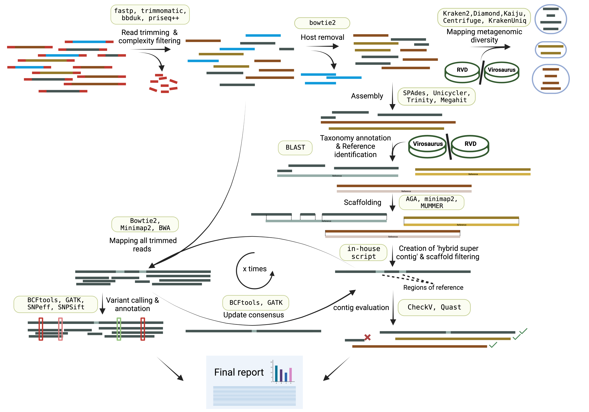

#  

<!--[](https://nf-co.re/viralgenie/results)
[](https://doi.org/10.5281/zenodo.XXXXXXX)
-->
[](https://www.nextflow.io/)
[](https://docs.conda.io/en/latest/)
[](https://www.docker.com/)
[](https://sylabs.io/docs/)
<!--
[](https://tower.nf/launch?pipeline=https://github.com/nf-core/viralgenie)

[](https://nfcore.slack.com/channels/viralgenie)
-->
[](https://twitter.com/nf_core)[](https://www.youtube.com/c/nf-core)

## Introduction
**nf-core/viralgenie** is a bioinformatics best-practice analysis pipeline for reconstructing consensus denovo genomes and identify intra-host variants from metagenomic sequencing data or enriched based sequencing data like hybrid capture.

The pipeline is built using [Nextflow](https://www.nextflow.io), a workflow tool to run tasks across multiple compute infrastructures in a very portable manner. It uses Docker/Singularity containers making installation trivial and results highly reproducible. The [Nextflow DSL2](https://www.nextflow.io/docs/latest/dsl2.html) implementation of this pipeline uses one container per process which makes it much easier to maintain and update software dependencies. Where possible, these processes have been submitted to and installed from [nf-core/modules](https://github.com/nf-core/modules) in order to make them available to all nf-core pipelines, and to everyone within the Nextflow community!

<!-- TODO nf-core: Add full-sized test dataset and amend the paragraph below if applicable -->

On release, automated continuous integration tests run the pipeline on a full-sized dataset on the AWS cloud infrastructure. This ensures that the pipeline runs on AWS, has sensible resource allocation defaults set to run on real-world datasets, and permits the persistent storage of results to benchmark between pipeline releases and other analysis sources.The results obtained from the full-sized test can be viewed on the [nf-core website](https://nf-co.re/viralgenie/results).

## Pipeline summary

__Pipeline is still under active development and not all steps have been implemented.__


<!-- TODO nf-core: Fill in short bullet-pointed list of the default steps in the pipeline -->
<!-- TODO nf-core: include the [`???`] in all steps-->

Tools given for each step can change as benchmarking is in progress.
1. Read QC ([`FastQC`](https://www.bioinformatics.babraham.ac.uk/projects/fastqc/),[`falco`](https://github.com/smithlabcode/falco))
2. Performs optional read pre-processing
   - Adapter trimming([`fastp`](https://github.com/OpenGene/fastp), [`Trimmomatic`](https://github.com/usadellab/Trimmomatic))
   - Low complexity and quality filtering ([`bbduk`](https://jgi.doe.gov/data-and-tools/software-tools/bbtools/), [`PRINSEQ++`](https://github.com/Adrian-Cantu/PRINSEQ-plus-plus))
   - Host-read removal ([`BowTie2`](http://bowtie-bio.sourceforge.net/bowtie2/))
3. Supports statistics for host-read removal ([`Samtools`](http://www.htslib.org/))
4. Metagenomic diveristy mapping
   - Performs taxonomic classification and/or profiling using one or more of:
     + [`Kraken2`](https://ccb.jhu.edu/software/kraken2/)
     + [`DIAMOND`](https://github.com/bbuchfink/diamond)
     + [`Centrifuge`](https://ccb.jhu.edu/software/centrifuge/)
     + [`Kaiju`](https://kaiju.binf.ku.dk/)
     + [`KrakenUniq`](https://github.com/fbreitwieser/krakenuniq)
   - Perform optional post-processing ([`bracken`](https://ccb.jhu.edu/software/bracken/))
   - Plotting Kraken2, Centrifuge, Kaiju and MALT results ([`Krona`](https://hpc.nih.gov/apps/kronatools.html))
5. Denovo assembly ([`SPAdes`](http://cab.spbu.ru/software/spades/), [`Unicycler`](https://github.com/rrwick/Unicycler), [`minia`](https://github.com/GATB/minia))
6. Taxonomy annotation and contig reference identification ([`blastn`](https://blast.ncbi.nlm.nih.gov/Blast.cgi?PAGE_TYPE=BlastSearch))
7. Scaffolding of contigs ([`AGA`](https://github.com/emweb/aga), [`minimap2`](https://github.com/lh3/minimap2), [`MUMMER`](https://github.com/mummer4/mummer)
8. Creation of hybrid supercontig by combining contigs and the reference.
9. Mapping filtered reads to hybrid supercontig ([`BowTie2`](http://bowtie-bio.sourceforge.net/bowtie2/),[`minimap2`](https://github.com/lh3/minimap2)
10. Update consensus genome with mapped reads ([`BCFTools`](http://samtools.github.io/bcftools/bcftools.html),[`GATK`](https://github.com/broadinstitute/gatk))
11. Repeat step 9-10 x times
12. Variant calling and annotation ([`BCFTools`](http://samtools.github.io/bcftools/bcftools.html),[`GATK`](https://github.com/broadinstitute/gatk),[`SnpEff`](http://snpeff.sourceforge.net/SnpEff.html), [`SnpSift`](http://snpeff.sourceforge.net/SnpSift.html))
13. Assembly & contig evaluation ([`QUAST`](http://quast.sourceforge.net/quast),[`CheckV`](https://bitbucket.org/berkeleylab/checkv/src/master/))
14. Present QC and visualisation for raw read, alignment, assembly and variant calling results ([`MultiQC`](http://multiqc.info/))

## Quick Start

1. Install [`Nextflow`](https://www.nextflow.io/docs/latest/getstarted.html#installation) (`>=22.10.1`)

2. Install any of [`Docker`](https://docs.docker.com/engine/installation/), [`Singularity`](https://www.sylabs.io/guides/3.0/user-guide/) (you can follow [this tutorial](https://singularity-tutorial.github.io/01-installation/)), [`Podman`](https://podman.io/), [`Shifter`](https://nersc.gitlab.io/development/shifter/how-to-use/) or [`Charliecloud`](https://hpc.github.io/charliecloud/) for full pipeline reproducibility _(you can use [`Conda`](https://conda.io/miniconda.html) both to install Nextflow itself and also to manage software within pipelines. Please only use it within pipelines as a last resort; see [docs](https://nf-co.re/usage/configuration#basic-configuration-profiles))_.

3. Download the repository
   ```bash
   git clone git@github.com:Joon-Klaps/viralgenie.git
   ```

4. Test it on a minimal dataset with a single command:

   ```bash
   nextflow run viralgenie/main.nf -profile test,YOURPROFILE --outdir <OUTDIR>
   ```

   Note that some form of configuration will be needed so that Nextflow knows how to fetch the required software. This is usually done in the form of a config profile (`YOURPROFILE` in the example command above). You can chain multiple config profiles in a comma-separated string.

   > - The pipeline comes with config profiles called `docker`, `singularity`, `podman`, `shifter`, `charliecloud` and `conda` which instruct the pipeline to use the named tool for software management. For example, `-profile test,docker`.
   > - Please check [nf-core/configs](https://github.com/nf-core/configs#documentation) to see if a custom config file to run nf-core pipelines already exists for your Institute. If so, you can simply use `-profile <institute>` in your command. This will enable either `docker` or `singularity` and set the appropriate execution settings for your local compute environment.
   > - If you are using `singularity`, please use the [`nf-core download`](https://nf-co.re/tools/#downloading-pipelines-for-offline-use) command to download images first, before running the pipeline. Setting the [`NXF_SINGULARITY_CACHEDIR` or `singularity.cacheDir`](https://www.nextflow.io/docs/latest/singularity.html?#singularity-docker-hub) Nextflow options enables you to store and re-use the images from a central location for future pipeline runs.
   > - If you are using `conda`, it is highly recommended to use the [`NXF_CONDA_CACHEDIR` or `conda.cacheDir`](https://www.nextflow.io/docs/latest/conda.html) settings to store the environments in a central location for future pipeline runs.

4. Start running your own analysis!

   ```bash
   nextflow run viralgenie/main.nf --input samplesheet.csv --outdir <OUTDIR> -profile <docker/singularity/podman/shifter/charliecloud/conda/institute>
   ```

 <!-- TODO: Make a github wiki
## Documentation

The nf-core/viralgenie pipeline comes with documentation about the pipeline [usage](https://nf-co.re/viralgenie/usage), [parameters](https://nf-co.re/viralgenie/parameters) and [output](https://nf-co.re/viralgenie/output).
-->
## Credits

viralgenie was originally written by joon.klaps@kuleuven.be.

We thank the following people for their extensive assistance in the development of this pipeline:
`Philippe Lemey`

<!-- TODO nf-core: If applicable, make list of people who have also contributed -->

## Contributions and Support

If you would like to contribute to this pipeline, please see the [contributing guidelines](.github/CONTRIBUTING.md).
<!--
For further information or help, don't hesitate to get in touch on the [Slack `#viralgenie` channel](https://nfcore.slack.com/channels/viralgenie) (you can join with [this invite](https://nf-co.re/join/slack)).
-->

## Citations

<!-- TODO nf-core: Add citation for pipeline after first release. Uncomment lines below and update Zenodo doi and badge at the top of this file. -->
<!-- If you use  nf-core/viralgenie for your analysis, please cite it using the following doi: [10.5281/zenodo.XXXXXX](https://doi.org/10.5281/zenodo.XXXXXX) -->

<!-- TODO nf-core: Add bibliography of tools and data used in your pipeline -->

An extensive list of references for the tools used by the pipeline can be found in the [`CITATIONS.md`](CITATIONS.md) file.

You can cite the `nf-core` publication as follows:

> **The nf-core framework for community-curated bioinformatics pipelines.**
>
> Philip Ewels, Alexander Peltzer, Sven Fillinger, Harshil Patel, Johannes Alneberg, Andreas Wilm, Maxime Ulysse Garcia, Paolo Di Tommaso & Sven Nahnsen.
>
> _Nat Biotechnol._ 2020 Feb 13. doi: [10.1038/s41587-020-0439-x](https://dx.doi.org/10.1038/s41587-020-0439-x).
