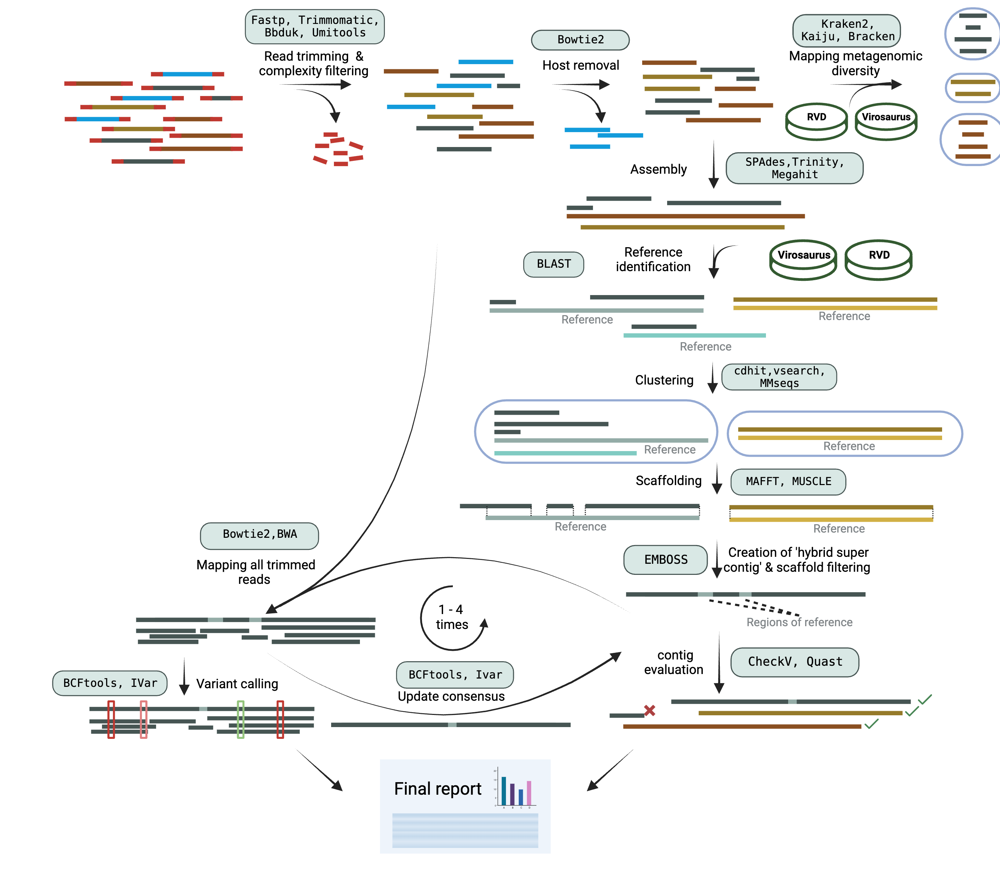

#  

<!--[](https://nf-co.re/viralgenie/results)
[](https://doi.org/10.5281/zenodo.XXXXXXX)
-->

[](https://www.nextflow.io/)
[](https://docs.conda.io/en/latest/)
[](https://www.docker.com/)
[](https://sylabs.io/docs/)

<!--
[](https://tower.nf/launch?pipeline=https://github.com/Joon-Klaps/viralgenie)

[](https://nfcore.slack.com/channels/viralgenie)-->

[](https://twitter.com/nf_core)[](https://mstdn.science/@nf_core)[](https://www.youtube.com/c/nf-core)

## Introduction

<!-- TODO nf-core: Write a 1-2 sentence summary of what data the pipeline is for and what it does -->

**Joon-Klaps/viralgenie** is a bioinformatics best-practice analysis pipeline for reconstructing consensus genomes and to identify intra-host variants from metagenomic sequencing data or enriched based sequencing data like hybrid capture.

## Pipeline summary



Tools given for each step can change as benchmarking is in progress.

1. Read QC ([`FastQC`](https://www.bioinformatics.babraham.ac.uk/projects/fastqc/))
2. Performs optional read pre-processing
   - Adapter trimming([`fastp`](https://github.com/OpenGene/fastp), [`Trimmomatic`](https://github.com/usadellab/Trimmomatic))
   - Low complexity and quality filtering ([`bbduk`](https://jgi.doe.gov/data-and-tools/software-tools/bbtools/))
   - Host-read removal ([`BowTie2`](http://bowtie-bio.sourceforge.net/bowtie2/))
3. Metagenomic diveristy mapping
   - Performs taxonomic classification and/or profiling using one or more of:
     - [`Kraken2`](https://ccb.jhu.edu/software/kraken2/)
     - [`Kaiju`](https://kaiju.binf.ku.dk/)
   - Perform optional post-processing ([`bracken`](https://ccb.jhu.edu/software/bracken/))
   - Plotting Kraken2, Centrifuge, Kaiju and MALT results ([`Krona`](https://hpc.nih.gov/apps/kronatools.html))
4. Denovo assembly ([`SPAdes`](http://cab.spbu.ru/software/spades/), [`TRINITY`](https://github.com/trinityrnaseq/trinityrnaseq), [`megahit`](https://github.com/voutcn/megahit)), combine contigs.
5. Contig cluster annotation & binning ([`blastn`](https://blast.ncbi.nlm.nih.gov/Blast.cgi?PAGE_TYPE=BlastSearch))

   - Identify top 5 blast hits
   - Merge blast hit seqs and contigs into a single file & cluster ([`cdhit`](https://sites.google.com/view/cd-hit), [`vsearch`](https://github.com/torognes/vsearch/wiki/Clustering))
   - Filter for only contigs that correspond to the identified centroid

6. Scaffolding of contigs ([`MAFFT`](https://mafft.cbrc.jp/alignment/server/), [`MUSCLE`](https://www.drive5.com/muscle/))
7. Creation of hybrid supercontig by combining contigs and the reference.
8. Mapping filtered reads to hybrid supercontig ([`BowTie2`](http://bowtie-bio.sourceforge.net/bowtie2/),[`BWAmem2`](https://github.com/bwa-mem2/bwa-mem2))
9. Update consensus genome with mapped reads ([`BCFTools`](http://samtools.github.io/bcftools/bcftools.html),[`iVar`](https://andersen-lab.github.io/ivar/html/manualpage.html))
10. Repeat step 8-9 multiple times
11. Variant calling and annotation ([`BCFTools`](http://samtools.github.io/bcftools/bcftools.html),[`iVar`](https://andersen-lab.github.io/ivar/html/manualpage.html))
12. Assembly & contig evaluation ([`QUAST`](http://quast.sourceforge.net/quast),[`CheckV`](https://bitbucket.org/berkeleylab/checkv/src/master/),[`blastn`](https://blast.ncbi.nlm.nih.gov/Blast.cgi))
13. Present QC and visualisation for raw read, alignment, assembly and variant calling results ([`MultiQC`](http://multiqc.info/))

## Usage

> **Note**
> If you are new to Nextflow and nf-core, please refer to [this page](https://nf-co.re/docs/usage/installation) on how
> to set-up Nextflow. Make sure to [test your setup](https://nf-co.re/docs/usage/introduction#how-to-run-a-pipeline)
> with `-profile test` before running the workflow on actual data.

Now, you can run the pipeline using:

```bash
nextflow run viralgenie/main.nf \
   -profile <docker/singularity/.../institute> \
   --input samplesheet.csv \
   --outdir <OUTDIR>
```

> **Warning:**
> Please provide pipeline parameters via the CLI or Nextflow `-params-file` option. Custom config files including those
> provided by the `-c` Nextflow option can be used to provide any configuration _**except for parameters**_;
> see [docs](https://nf-co.re/usage/configuration#custom-configuration-files).

For more details and further functionality, please refer to the [usage documentation](https://nf-co.re/viralgenie/usage) and the [parameter documentation](https://nf-co.re/viralgenie/parameters).

## Credits

viralgenie was originally written by joon.klaps@kuleuven.be.

We thank the following people for their extensive assistance in the development of this pipeline:

- [`Philippe Lemey`](https://github.com/plemey)
- [`Liana Kafetzopoulou`](https://github.com/LianaKafetzopoulou)

<!-- TODO nf-core: If applicable, make list of people who have also contributed -->

## Contributions and Support

If you would like to contribute to this pipeline, please see the [contributing guidelines](.github/CONTRIBUTING.md).

<!--
For further information or help, don't hesitate to get in touch on the [Slack `#viralgenie` channel](https://nfcore.slack.com/channels/viralgenie) (you can join with [this invite](https://nf-co.re/join/slack)).
-->

## Citations

<!-- TODO nf-core: Add citation for pipeline after first release. Uncomment lines below and update Zenodo doi and badge at the top of this file. -->
<!-- If you use  Joon-Klaps/viralgenie for your analysis, please cite it using the following doi: [10.5281/zenodo.XXXXXX](https://doi.org/10.5281/zenodo.XXXXXX) -->

<!-- TODO nf-core: Add bibliography of tools and data used in your pipeline -->

An extensive list of references for the tools used by the pipeline can be found in the [`CITATIONS.md`](CITATIONS.md) file.

You can cite the `nf-core` publication as follows:

> **The nf-core framework for community-curated bioinformatics pipelines.**
>
> Philip Ewels, Alexander Peltzer, Sven Fillinger, Harshil Patel, Johannes Alneberg, Andreas Wilm, Maxime Ulysse Garcia, Paolo Di Tommaso & Sven Nahnsen.
>
> _Nat Biotechnol._ 2020 Feb 13. doi: [10.1038/s41587-020-0439-x](https://dx.doi.org/10.1038/s41587-020-0439-x).
