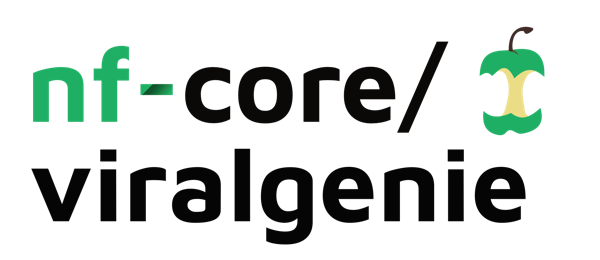

<h1>
  <picture>
    <source media="(prefers-color-scheme: dark)" srcset="docs/images/nf-core-viralgenie_logo_dark.png">
    
  </picture>
</h1>

<!--[](https://nf-co.re/viralgenie/results)
[](https://doi.org/10.5281/zenodo.XXXXXXX)
-->

[](https://www.nextflow.io/) [](https://docs.conda.io/en/latest/) [](https://www.docker.com/) [](https://sylabs.io/docs/)
[](https://tower.nf/launch?pipeline=https://github.com/Joon-Klaps/viralgenie)

[](https://github.com/Joon-Klaps/viralgenie/actions?query=workflow%3A%22nf-core+CI%22)
[](https://github.com/Joon-Klaps/viralgenie/actions?query=workflow%3A%22nf-core+linting%22)

<!-- [](https://nfcore.slack.com/channels/viralgenie)-->

> [!TIP]
> Make sure to checkout the [viralgenie website](https://joon-klaps.github.io/viralgenie/latest/) for more elaborate documentation!

## Introduction

**Viralgenie** is a bioinformatics best-practice analysis pipeline for reconstructing consensus genomes and to identify intra-host variants from metagenomic sequencing data or enriched based sequencing data like hybrid capture.

## Pipeline summary


1. Read QC ([`FastQC`](https://www.bioinformatics.babraham.ac.uk/projects/fastqc/))
2. Performs optional read pre-processing
    - Adapter trimming([`fastp`](https://github.com/OpenGene/fastp), [`Trimmomatic`](https://github.com/usadellab/Trimmomatic))
    - Read UMI deduplication ([`HUMID`](https://humid.readthedocs.io/en/latest/usage.html))
    - Low complexity and quality filtering ([`bbduk`](https://jgi.doe.gov/data-and-tools/software-tools/bbtools/), [`prinseq++`](https://github.com/Adrian-Cantu/PRINSEQ-plus-plus))
    - Host-read removal ([`BowTie2`](http://bowtie-bio.sourceforge.net/bowtie2/))
3. Metagenomic diveristy mapping
    - Performs taxonomic classification and/or profiling using one or more of:
        - [`Kraken2`](https://ccb.jhu.edu/software/kraken2/)
        - [`Bracken`][https://ccb.jhu.edu/software/bracken/](optional)
        - [`Kaiju`](https://kaiju.binf.ku.dk/)
    - Plotting Kraken2 and Kaiju ([`Krona`](https://hpc.nih.gov/apps/kronatools.html))
4. Denovo assembly ([`SPAdes`](http://cab.spbu.ru/software/spades/), [`TRINITY`](https://github.com/trinityrnaseq/trinityrnaseq), [`megahit`](https://github.com/voutcn/megahit)), combine contigs.
5. [Optional] extend the contigs with [sspace_basic](https://github.com/nsoranzo/sspace_basic) and filter with [`prinseq++`](https://github.com/Adrian-Cantu/PRINSEQ-plus-plus)
6. [Optional] Map reads to contigs for coverage estimation ([`BowTie2`](http://bowtie-bio.sourceforge.net/bowtie2/),[`BWAmem2`](https://github.com/bwa-mem2/bwa-mem2) and [`BWA`](https://github.com/lh3/bwa))
7. Contig reference idententification ([`blastn`](https://blast.ncbi.nlm.nih.gov/Blast.cgi?PAGE_TYPE=BlastSearch))
    - Identify top 5 blast hits
    - Merge blast hit and all contigs of a sample
8. [Optional] Precluster contigs based on taxonomy
    - Identify taxonomy [`Kraken2`](https://ccb.jhu.edu/software/kraken2/) and\or [`Kaiju`](https://kaiju.binf.ku.dk/)
    - Resolve potential inconsistencies in taxonomy & taxon filtering | simplification `bin/extract_precluster.py`
9. Cluster contigs (or every taxonomic bin) of samples, options are:
    - [`cdhitest`](https://sites.google.com/view/cd-hit)
    - [`vsearch`](https://github.com/torognes/vsearch/wiki/Clustering)
    - [`mmseqs-linclust`](https://github.com/soedinglab/MMseqs2/wiki#linear-time-clustering-using-mmseqs-linclust)
    - [`mmseqs-cluster`](https://github.com/soedinglab/MMseqs2/wiki#cascaded-clustering)
    - [`vRhyme`](https://github.com/AnantharamanLab/vRhyme)
    - [`Mash`](https://github.com/marbl/Mash)
10. [Optional] Remove clusters with low read coverage. `bin/extract_clusters.py`
11. Scaffolding of contigs to centroid ([`Minimap2`](https://github.com/lh3/minimap2), [`iVar-consensus`](https://andersen-lab.github.io/ivar/html/manualpage.html))
12. [Optional] Annotate 0-depth regions with external reference `bin/lowcov_to_reference.py`.
13. [Optional] Select best reference from `--mapping_constrains`:
    - [`Mash sketch`](https://github.com/marbl/Mash)
    - [`Mash screen`](https://github.com/marbl/Mash)
14. Mapping filtered reads to supercontig and mapping constrains([`BowTie2`](http://bowtie-bio.sourceforge.net/bowtie2/),[`BWAmem2`](https://github.com/bwa-mem2/bwa-mem2) and [`BWA`](https://github.com/lh3/bwa))
15. [Optional] Deduplicate reads ([`Picard`](https://broadinstitute.github.io/picard/) or if UMI's are used [`UMI-tools`](https://umi-tools.readthedocs.io/en/latest/QUICK_START.html))
16. Variant calling and filtering ([`BCFTools`](http://samtools.github.io/bcftools/bcftools.html),[`iVar`](https://andersen-lab.github.io/ivar/html/manualpage.html))
17. Create consensus genome ([`BCFTools`](http://samtools.github.io/bcftools/bcftools.html),[`iVar`](https://andersen-lab.github.io/ivar/html/manualpage.html))
18. Repeat step 12-15 multiple times for the denovo contig route
19. Consensus evaluation and annotation ([`QUAST`](http://quast.sourceforge.net/quast),[`CheckV`](https://bitbucket.org/berkeleylab/checkv/src/master/),[`blastn`](https://blast.ncbi.nlm.nih.gov/Blast.cgi), [`mmseqs-search`](https://github.com/soedinglab/MMseqs2/wiki#batch-sequence-searching-using-mmseqs-search), [`MAFFT` - alignment of contigs vs iterations & consensus](https://mafft.cbrc.jp/alignment/software/))
20. Result summary visualisation for raw read, alignment, assembly, variant calling and consensus calling results ([`MultiQC`](http://multiqc.info/))

## Usage

> [!NOTE]
> If you are new to Nextflow and nf-core, please refer to [this page](https://nf-co.re/docs/usage/installation) on how to set-up Nextflow. Make sure to [test your setup](https://nf-co.re/docs/usage/introduction#how-to-run-a-pipeline) with `-profile test` before running the workflow on actual data.

First, prepare a samplesheet with your input data that looks as follows:

`samplesheet.csv`:

```csv
sample,fastq_1,fastq_2
sample1,AEG588A1_S1_L002_R1_001.fastq.gz,AEG588A1_S1_L002_R2_001.fastq.gz
sample2,AEG588A5_S5_L003_R1_001.fastq.gz,
sample3,AEG588A3_S3_L002_R1_001.fastq.gz,AEG588A3_S3_L002_R2_001.fastq.gz
```

Each row represents a fastq file (single-end) or a pair of fastq files (paired end).

Now, you can run the pipeline using:

```bash
nextflow run nf-core/viralgenie \
   -profile <docker/singularity/.../institute> \
   --input samplesheet.csv \
   --outdir <OUTDIR>
```

> [!WARNING]
> Please provide pipeline parameters via the CLI or Nextflow `-params-file` option. Custom config files including those provided by the `-c` Nextflow option can be used to provide any configuration _**except for parameters**_; see [docs](https://nf-co.re/docs/usage/getting_started/configuration#custom-configuration-files).

For more details and further functionality, please refer to the [usage documentation](https://joon-klaps.github.io/viralgenie/latest/usage) and the [parameter documentation](https://joon-klaps.github.io/viralgenie/latest/parameters).

## Pipeline output

To see the results of an example test run with a full size dataset refer to the [results](https://joon-klaps.github.io/viralgenie/latest/output) tab on the nf-core website pipeline page.
For more details about the output files and reports, please refer to the
[output documentation](https://joon-klaps.github.io/viralgenie/latest/output).

## Credits

Viralgenie was originally written by [`Joon-Klaps`](https://github.com/Joon-Klaps).

We thank the following people for their extensive assistance in the development of this pipeline:

- [`Philippe Lemey`](https://github.com/plemey)
- [`Liana Kafetzopoulou`](https://github.com/LianaKafetzopoulou)
- [`nf-core community`](https://nf-co.re/)

## Contributions and Support

If you would like to contribute to this pipeline, please see the [contributing guidelines](https://joon-klaps.github.io/viralgenie/latest/CONTRIBUTING).

<!--
For further information or help, don't hesitate to get in touch on the [Slack `#viralgenie` channel](https://nfcore.slack.com/channels/viralgenie) (you can join with [this invite](https://nf-co.re/join/slack)).
-->

## Citations

<!-- If you use nf-core/viralgenie for your analysis, please cite it using the following doi: [10.5281/zenodo.XXXXXX](https://doi.org/10.5281/zenodo.XXXXXX) -->
>[!WARNING]
> Viralgenie is currently not Published. Please cite as:
> Klaps J, Lemey P, Kafetzopoulou L. Viralgenie: A metagenomics analysis pipeline for eukaryotic viruses. **Github** <https://github.com/Joon-Klaps/viralgenie>

An extensive list of references for the tools used by the pipeline can be found in the [`CITATIONS.md`](https://joon-klaps.github.io/viralgenie/latest/CITATIONS) file.

<!-- You can cite the `nf-core` publication as follows:

> **The nf-core framework for community-curated bioinformatics pipelines.**
>
> Philip Ewels, Alexander Peltzer, Sven Fillinger, Harshil Patel, Johannes Alneberg, Andreas Wilm, Maxime Ulysse Garcia, Paolo Di Tommaso & Sven Nahnsen.
>
> _Nat Biotechnol._ 2020 Feb 13. doi: [10.1038/s41587-020-0439-x](https://dx.doi.org/10.1038/s41587-020-0439-x). -->
