# Output

## Introduction

This document describes the output produced by the pipeline. Most of the plots are taken from the MultiQC report, which summarises results at the end of the pipeline.

The directories listed below will be created in the results directory after the pipeline has finished. All paths are relative to the top-level results directory.

## Preprocessing

All output files of the preprocessing steps can be found in the directory `preprocessing/`.

### FastQC

:::note{title="Output files" collapse}

- `fastqc/{raw,trim,host}`
- `*_fastqc.html`: FastQC report containing quality metrics.
- `*_fastqc.zip`: Zip archive containing the FastQC report, tab-delimited data file, and plot images.

:::

[FastQC](http://www.bioinformatics.babraham.ac.uk/projects/fastqc/) gives general quality metrics about your sequenced reads. It provides information about the quality score distribution across your reads, per base sequence content (%A/T/G/C), adapter contamination, and overrepresented sequences. For further reading and documentation see the [FastQC help pages](http://www.bioinformatics.babraham.ac.uk/projects/fastqc/Help/).

:::tip
The FastQC plots displayed in the MultiQC report show _untrimmed_, _trimmed_, and _host filtered_ reads. Make sure to check the section titles for the correct set of reads.
:::

### fastp

[fastp](https://github.com/OpenGene/fastp) is a FASTQ pre-processing tool for quality control, trimming of adapters, quality filtering, and other features.

:::note{title="Output files" collapse}

- `fastp/`
  - `report/<sample-id>.*{html,json}`: report files in different formats.
  - `log/<sample-id>.*{html,json}`: log files.
  - `<sample-id>.fastp.fastq.gz`: file with the trimmed fastq reads.
  - `fail/<sample-id>.fail.fastq.gz`: file with reads that didn't suffice quality controls.

:::

By default, nf-core/viralmetagenome will only provide the report and log files if fastp is selected. The trimmed reads can be saved by specifying `--save_intermediate_reads` or `--save_final_reads 'trimming'`. Similarly, the saving of the output reads can be enabled with `--save_trimmed_fail`.

### Trimmomatic

[Trimmomatic](http://www.usadellab.org/cms/?page=trimmomatic) is a FASTQ pre-processing tool for quality control, trimming of adapters, quality filtering, and other features.

:::note{title="Output files" collapse}

- `trimmomatic/`
  - `<sample-id>.fastq.gz`: file with the trimmed fastq reads.
  - `log/<sample-id>.*{html,txt,zip}`: log files generated by Trimmomatic.

:::

By default, nf-core/viralmetagenome will only provide the report and log files if Trimmomatic is selected. The trimmed reads can be saved by specifying `--save_intermediate_reads` or `--save_final_reads 'trimming'`.

### UMI-deduplication

UMI-deduplication can be done at the read level using [`HUMID`](https://humid.readthedocs.io/en/latest/usage.html). nf-core/viralmetagenome also provides the opportunity to extract the UMI from the read using [`UMI-tools extract`](https://umi-tools.readthedocs.io/en/latest/QUICK_START.html#step-3--extract-the-umis) if the UMI is not in the header. Results will be stored in the `preprocessing/umi` directory.

:::note{title="Output files" collapse}

- `umi/`
  - `humid/`
  - `log/<sample-id>.log`: log file of HUMID.
  - `annotated/<sample-id>_annotated_*.fastq.gz`: annotated FastQ files, reads will have their assigned cluster in the read header.
  - `deduplicated/<sample-id>_deduplicated_*.fastq.gz`: deduplicated FastQ files.
  - `umitools/`
  - `log/<sample-id>.log`: log file of UMI-tools.
  - `extracts/<sample-id>.umi_extract*.fastq.gz`: fastq file where UMIs have been removed from the read and moved to the read header.

:::

By default, nf-core/viralmetagenome will not assume reads have UMIs. To enable this, use the parameter `--with_umi`. Specify where UMI deduplication should occur with `--umi_deduplicate` if at a `read` level, on a `mapping` level, or `both` at a read and mapping level. The deduplicated reads can be saved by specifying `--save_intermediate_reads` or `--save_final_reads 'deduplication'`.

### BBDuk

[BBDuk](https://jgi.doe.gov/data-and-tools/software-tools/bbtools/bb-tools-user-guide/bbduk-guide/) stands for Decontamination Using Kmers. BBDuk was developed to combine most common data-quality-related trimming, filtering, and masking operations into a single high-performance tool.

It is used in nf-core/viralmetagenome for complexity filtering using different algorithms. This means that it will remove reads with low sequence diversity (e.g., mono- or dinucleotide repeats).

:::note{title="Output files" collapse}

- `bbduk/`
  - `log/<sample-id>.bbduk.log`: log file containing filtering statistics.
  - `<sample-id>.fastq.gz`: resulting FASTQ file without low-complexity reads.

:::

By default, nf-core/viralmetagenome will only provide the log files of BBDuk. The filtered reads can be saved by specifying `--save_intermediate_reads` or `--save_final_reads 'complexity'`.

### prinseq++

[prinseq++](https://github.com/Adrian-Cantu/PRINSEQ-plus-plus) is used in nf-core/viralmetagenome for complexity filtering using different algorithms. This means that it will remove reads with low sequence diversity (e.g., mono- or dinucleotide repeats).

:::note{title="Output files" collapse}

- `prinseq/`
  - `log/<sample-id>.log`: log file containing filtering statistics.
  - `<sample-id>.fastq.gz`: resulting FASTQ file without low-complexity reads.

:::

By default, nf-core/viralmetagenome will only provide the log files of prinseq++. The filtered reads can be saved by specifying `--save_intermediate_reads` or `--save_final_reads 'complexity'`.

### Hostremoval-Kraken2

[Kraken2](https://ccb.jhu.edu/software/kraken2/) is a taxonomic sequence classifier that assigns taxonomic labels to DNA sequences. Kraken examines the k-mers within a query sequence and uses the information within those k-mers to query a database. That database maps k-mers to the lowest common ancestor (LCA) of all genomes known to contain a given k-mer.

:::note{title="Output files" collapse}

- `hostremoval-kraken2/`
  - `<sample-id>_kraken2_host.report.txt`: A profile of the aligned reads to a given host contamination database.
  - `<sample-id>_kraken2_host.unclassified*.fastq.gz`: resulting FASTQ file with reads that don't have any matches to the given host contamination database.

:::

By default, nf-core/viralmetagenome will only provide the log files of Kraken2 which are visualized in [MultiQC](#multiqc). The filtered reads can be saved by specifying `--save_intermediate_reads` or `--save_final_reads 'host'`.

## Metagenomic Diversity

The results of the metagenomic diversity analysis are stored in the directory `metagenomic_diversity/`. Results are also visualized in the MultiQC report.
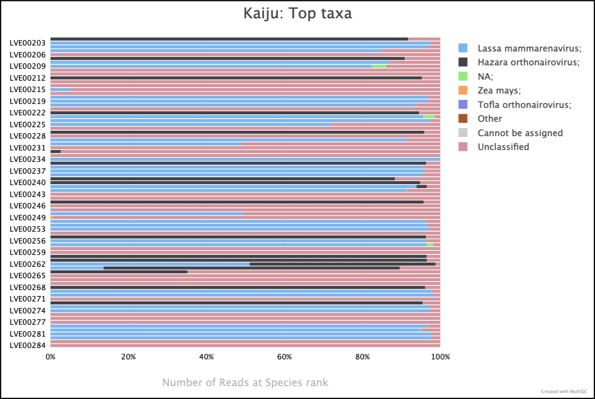

### Kraken2

[Kraken2](https://ccb.jhu.edu/software/kraken2/) is a taxonomic sequence classifier that assigns taxonomic labels to DNA sequences. Kraken examines the k-mers within a query sequence and uses the information within those k-mers to query a database. That database maps k-mers to the lowest common ancestor (LCA) of all genomes known to contain a given k-mer.

:::note{title="Output files" collapse}

- `metagenomic_diversity/kraken2/`
  - `<sample-id>.report.txt`: A Kraken2 report that summarizes the fraction abundance, taxonomic ID, number of k-mers, taxonomic path of all the hits in the Kraken2 run for a given sample. Will be 6 columns rather than 8 if `--save_minimizers` specified.
  - `<sample-id>_kraken2_host.unclassified*.fastq.gz`: resulting FASTQ file with reads that don't have any matches to the given host contamination database.
  - `<sample-id>.classified.fastq.gz`: FASTQ file containing all reads that had a hit against a reference in the database for a given sample.
  - `<sample-id>.unclassified.fastq.gz`: FASTQ file containing all reads that did not have a hit in the database for a given sample.
  - `<sample-id>.classifiedreads.txt`: A list of read IDs and the hits each read had against the database for a given sample.

:::

> [!NOTE]
> By default, nf-core/viralmetagenome will provide any classified or unclassified fastq files, specify this with `--kraken2_save_reads`. Similarly, for the classified reads table, specify this with `--kraken2_save_readclassification`.

### Kaiju

[Kaiju](https://kaiju.binf.ku.dk/) is a program for sensitive taxonomic classification of high-throughput sequencing reads from metagenomic data. It is based on the Burrows-Wheeler transform and the lowest common ancestor algorithm.

:::note{title="Output files" collapse}

- `metagenomic_diversity/kaiju/`
  - `<sample-id>.tsv`: Raw output from Kaiju with taxonomic rank, read ID, and taxonomic ID.
  - `<sample-id>.txt`: A summary of the taxonomic classification of the reads in the sample.

:::

### Krona

[Krona](https://github.com/marbl/Krona/wiki) is a hierarchical data visualization tool that can be used to visualize the taxonomic classification of metagenomic data.

:::note{title="Output files" collapse}

- `metagenomic_diversity/krona/`
  - `<kaiju|kraken2>_.html`: A HTML file containing the Krona visualization of the taxonomic classification of the reads in the sample.

:::

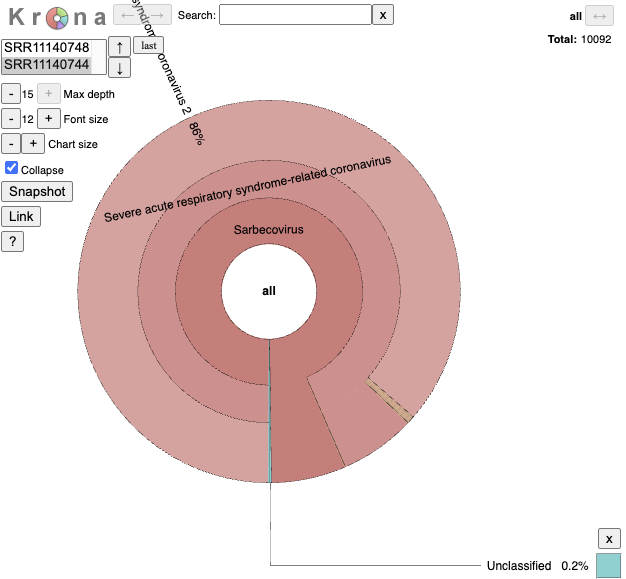

## Assembly & Polishing

The results of the assembly processes & polishing are stored in the directory `assembly/`.

Multiple intermediate files can be generated during the assembly process, some of them might not always be interesting to have. For this reason, there is an option to save the intermediate files with the `--save_intermediate_polishing` argument which is by default off.

### BBNorm - read normalisation

Setting `--normalise_reads` runs [`BBNorm`](https://jgi.doe.gov/data-and-tools/software-tools/bbtools/bb-tools-user-guide/bbnorm-guide/) before de novo assembly. BBNorm discards reads by k-mer coverage, flattening the depth of very highly covered regions.

Normalisation is applied **only to the reads handed to the assemblers**. Scaffold extension and the per-contig coverage that drives `--perc_reads_contig` continue to use the complete read set, and the reads used for mapping, variant calling and consensus generation are never normalised.

:::note{title="Output files" collapse}

- `assembly/intermediate/bbnorm/`
  - `<sample-id>.norm.fastq.gz`: The normalised reads passed to the assemblers. Only produced when `--normalise_reads` is set, and only published when `--save_intermediate_polishing` is also set.
  - `<sample-id>.norm.log`: BBNorm log reporting how many reads were kept and discarded.

:::

### Assemblers

Multiple assemblers [spades, trinity, megahit] can be used which have their results combined. Each assembler has its own directory in the `assembly/assemblers` directory, where there will be a subfolder for the contigs and the QC results from QUAST.

:::note{title="Output files" collapse}

- `assemblers/`
  - `spades/<spades_mode>/`
    - `contigs/<sample-id>_spades.fa.gz`: Contigs generated by SPAdes.
    - `log/<sample-id>_spades.log`: Directory containing the log file of the SPAdes run.
    - `quast/<sample-id>_spades.tsv`: Directory containing the QUAST report.
  - `trinity/`
    - `contigs/<sample-id>_trinity.fa.gz`: Contigs generated by Trinity.
    - `quast/<sample-id>_trinity.tsv`: Directory containing the QUAST report.
  - `megahit/`
    - `contigs/<sample-id>_megahit.fa.gz`: Contigs generated by Megahit.
    - `quast/<sample-id>_megahit.tsv`: Directory containing the QUAST report.
  - `tools_combined/<sample-id>.combined.fa`: Contigs generated by combining the results of the assemblers.

:::

QUAST results are also summarized and plotted in the MultiQC report.

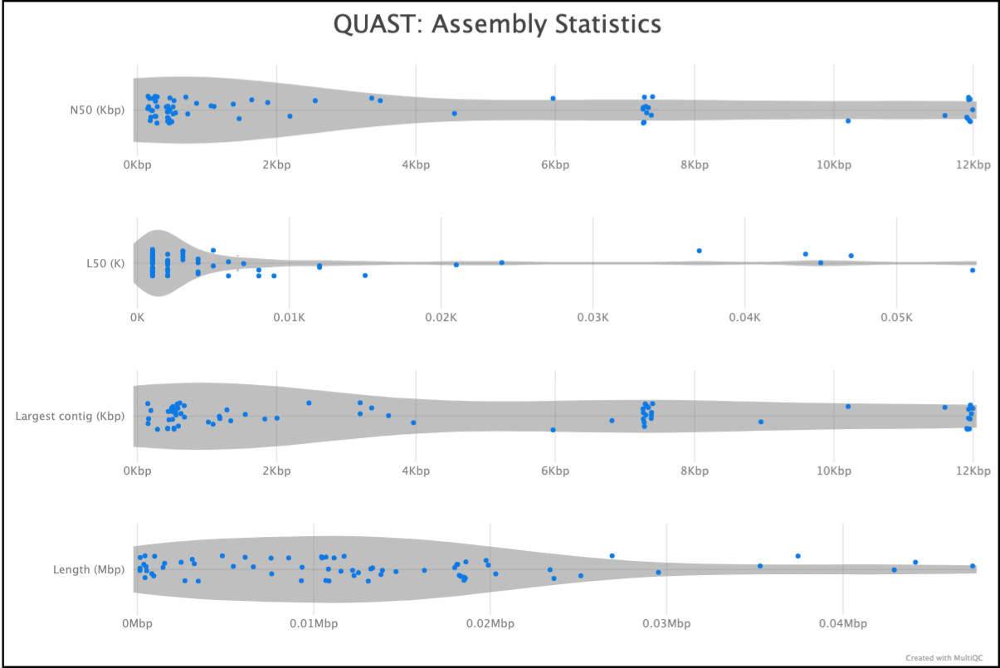

### SSPACE Basic

[SSPACE Basic](https://github.com/nsoranzo/sspace_basic) is a tool for scaffolding contigs using paired-end reads. It is modified from the SSAKE assembler and has the feature of extending contigs using reads that are unmappable in the contig assembly step.

:::note{title="Output files" collapse}

- `sspace_basic/`
- `scaffolds/<sample-id>.scaffolds.fasta`: Scaffolds generated by SSPACE Basic.
- `log/<sample-id>.*.txt`: Various txt files containing log and summary information on the SSPACE Basic run.

:::

### prinseq++ - contigs

[`prinseq++`](https://github.com/Adrian-Cantu/PRINSEQ-plus-plus) is used for complexity filtering of contigs.

:::note{title="Output files" collapse}

- `prinseq/`
  - `scaffolds/<sample-id>.scaffolds.fasta`: Scaffolds generated by SSPACE Basic.
  - `log/<sample-id>.*.txt`: Various txt files containing log and summary information on the SSPACE Basic run.

:::

### BLAST

[BLAST](https://blast.ncbi.nlm.nih.gov/Blast.cgi) is a sequence comparison tool that can be used to compare a query sequence against a database of sequences. In nf-core/viralmetagenome, BLAST is used to compare the contigs generated by the assemblers to a database of viral sequences.

By default, nf-core/viralmetagenome will only provide the BLAST results in a tabular format. It will have selected only for the top five hits and will also have a filtered version where it will only include hits with an e-value of 0.01 or lower, a bitscore of 50 or higher, and an alignment percentage of 0.80 or higher.

:::info{title="Column names" collapse}

- qseqid
- sseqid
- stitle
- pident
- qlen
- slen
- length
- mismatch
- gapopen
- qstart
- qend
- sstart
- send
- evalue
- bitscore

:::

:::note{title="Output files" collapse}

- `polishing/`
  - `blast/<sample-id>_filter.tsv`: Filtered BLAST results in tabular format.
  - `intermediate/blast/filtered-sequences/<sample-id>_withref.fa`: A FASTA containing the contigs together with selected BLAST-hit reference sequences.
  - `intermediate/blast/hits/<sample-id>.txt`: unfiltered BLAST results in tabular format.

:::

> [!NOTE]
> By default, nf-core/viralmetagenome will only provide the filtered blast.txt file. The intermediate files can be saved by specifying `--save_intermediate_polishing`.

### Preclustering - Kaiju & Kraken2

[Kaiju](https://kaiju.binf.ku.dk/) is a program for sensitive taxonomic classification of high-throughput sequencing reads from metagenomic data. It is based on the Burrows-Wheeler transform and the lowest common ancestor algorithm.

[Kraken2](https://ccb.jhu.edu/software/kraken2/) is a taxonomic sequence classifier that assigns taxonomic labels to DNA sequences. Kraken examines the k-mers within a query sequence and uses the information within those k-mers to query a database. That database maps k-mers to the lowest common ancestor (LCA) of all genomes known to contain a given k-mer.

:::note{title="Output files" collapse}

- `polishing/intermediate/precluster`
  - `kaiju/<sample-id>_kaiju.tsv`: Raw output from Kaiju with taxonomic rank, read ID, and taxonomic ID.
  - `kraken2/<sample-id>_kraken2_reports.txt`: A Kraken2 report that summarizes the fraction abundance, taxonomic ID, number of k-mers, taxonomic path of all the hits in the Kraken2 run for a given sample. Will be 6 columns rather than 8 if `--save_minimizers` specified.
  - `kraken2/<sample-id>_kraken2.classifiedreads.txt`: A list of read IDs and the hits each read had against the database for a given sample.
  - `merged_classifications/<sample-id>.txt`: Taxonomy merged based on the specified strategy, filtered based on specified filters, and simplified up to a certain taxonomy with the columns being taxonomic rank, read ID, and taxonomic ID.
  - `sequences/<sample-id>/<sample-id>_taxid<taxonomic ID>.fa`: Fasta file with the contigs that were classified to that specific taxonomic ID.

:::

> [!NOTE]
> By default, nf-core/viralmetagenome will not provide any preclustering files. The intermediate files can be saved by specifying `--save_intermediate_polishing`.

### Clustering

The final `clusters.tsv` file of each clustering method is always published to the `assembly/polishing/<cluster_method>` directory. Additional intermediate files — the per-cluster summary and the raw JSON clusters file — are only saved when `--save_intermediate_polishing` is specified.

:::note{title="Output files" collapse}

- `polishing/<cluster_method>/`
  - `<sample-id>/<sample-id>.clusters.tsv`: A tabular file with metadata on all clusters in a sample.

- `polishing/intermediate/cluster/` (only with `--save_intermediate_polishing`)
  - `<sample-id>/<sample-id>.summary_mqc.tsv`: A tabular file with comments used for [MultiQC](#multiqc) with statistics on the number of identified clusters in a sample.
  - `<sample-id>/<sample-id>.clusters.tsv`: Same cluster metadata table as above, kept here for inspection alongside the raw JSON.
  - `<sample-id>/<sample-id>.clusters.json`: The full clusters file in JSON format, from which `clusters.tsv` is derived.

:::

:::tip
Whenever there is a 'cl#' in the file name, it refers to the cluster number of that sample.
:::

> [!NOTE]
> By default, nf-core/viralmetagenome only publishes the final `<sample-id>.clusters.tsv` per sample in `assembly/polishing/<cluster_method>/`. The intermediate summary and JSON files can additionally be saved by specifying `--save_intermediate_polishing`.

#### CD-HIT-EST

[CD-HIT](https://github.com/weizhongli/cdhit) is a very fast, widely used program for clustering and comparing protein or nucleotide sequences.

:::note{title="Output files" collapse}

- `polishing/cdhit/`
  - `<sample-id>/<sample-id>.fa.clstr`: A cluster file containing the clustering information. where ">" starts a new cluster, a "\*" at the end means that this sequence is the representative or centroid of this cluster, and a "%" is the identity between this sequence and the representative.
  - `<sample-id>/<sample-id>.fa`: A fasta file containing the centroid sequence.

:::

#### vsearch-cluster

[vsearch](https://github.com/torognes/vsearch) implements a single-pass, greedy centroid-based clustering algorithm, similar to the algorithms implemented in usearch, DNAclust, and sumaclust for example. The output has to be in the `--uc` format or else the pipeline will not be able to process the output.

:::note{title="Output files" collapse}

- `polishing/vsearch/`
  - `<sample-id>/<sample-id>.tsv.gz`: A cluster file containing the clustering information.

:::

:::info{title="vsearch -uc columns" collapse}

1.  Entry (S, H, or C):
2.  Record type: S, H, or C.
3.  Cluster number (zero-based).
4.  Centroid length (S), query length (H), or cluster size (C).
5.  Percentage of similarity with the centroid sequence (H), or set to ’\*’ (S, C).
6.  Match orientation + or - (H), or set to ’_’ (S, C). Not used, always set to ’_’ (S, C) or to zero (H).
7.  Not used, always set to ’\*’ (S, C) or to zero (H).
8.  Set to ’\*’ (S, C) or, for H, compact representation of the pairwise alignment using the CIGAR format (Compact Idiosyncratic Gapped Alignment Report): M (match/mismatch), D (deletion), and I (insertion). The equal sign ’=’ indicates that the query is identical to the centroid sequence.
9.  Label of the query sequence (H), or of the centroid sequence (S, C). 10. Label of the centroid sequence (H), or set to ’\*’ (S, C).

:::

#### MMseqs2

[MMseqs2](https://github.com/soedinglab/MMseqs2/wiki) is a software suite to search and cluster huge protein and nucleotide sequence sets. The cascaded clustering workflow (`mmseqs-cluster`) first runs linclust, the linear-time clustering module of mmseqs (`mmseqs-linclust`), that can produce clustering’s down to 50% sequence identity in very short time.

:::note{title="Output files" collapse}

- `polishing/`
  - `mmseqs2/<sample-id>/<sample-id>.tsv`: A cluster file containing the clustering information. Where the first column is the cluster representative and the second column the member.
  - `intermediate/mmseqs/clustered_db/<sample-id>*`: A MMseqs2 database of the clustered sequences.
  - `intermediate/mmseqs/sequence_db/<sample-id>*`: A MMseqs2 database of the input sequences (contigs + blast hits).

:::

#### vRhyme

[vRhyme](https://github.com/AnantharamanLab/vRhyme) is a multi-functional tool for binning virus genomes from metagenomes. vRhyme functions by utilizing coverage variance comparisons and supervised machine learning classification of sequence features to construct viral metagenome-assembled genomes (vMAGs).

:::note{title="Output files" collapse}

- `polishing/vrhyme`
  - `<sample-id>/vRhyme_best_bins.#.membership.tsv`: scaffold membership of best bins.
  - `<sample-id>/vRhyme_best_bins.#.summary.tsv`: summary stats of best bins.

:::

#### Mash & Clusty

[Mash](https://github.com/marbl/Mash) calculates the distance between two sequences based on the jaccard distance. The Mash distance can be quickly computed from the size-reduced sketches alone, yet produces a result that strongly correlates with alignment-based measures such as the Average Nucleotide Identity (ANI). Next, [Clusty](https://github.com/refresh-bio/clusty) uses the Mash distances to cluster the sequences based on a specified ANI threshold with the given `--network_clustering` option (default `single`).

:::note{title="Output files" collapse}

- `polishing/mash`
  - `<sample-id>/dist/*.tsv`: A distance matrix of the genomes with ANI.
  - `<sample-id>/cluster/*.tsv`: A table where the first column represents the contig/genome and the second column it's corresponding cluster.

:::

### Minimap2

[Minimap2](https://github.com/lh3/minimap2) is a versatile sequence alignment program that aligns larger DNA or mRNA sequences against a large reference database.

:::note{title="Output files" collapse}

- `polishing/scaffolding/<sample-id>/minimap`
  - `<sample-id>_cl#.bam`: A BAM file containing the alignment of contigs to the centroid.
  - `<sample-id>_cl#.mmi`: The centroid index file.

:::

> [!NOTE]
> By default, nf-core/viralmetagenome will not provide the minimap output files. The intermediate files can be saved by specifying `--save_intermediate_polishing`.

### iVar contig consensus (scaffolding)

[iVar](https://andersen-lab.github.io/ivar/html/manualpage.html#autotoc_md19) is a computational method for calling consensus sequences from viral populations.

:::note{title="Output files" collapse}

- `polishing/scaffolding/<sample-id>`
  - `<sample-id>_cl#_consensus.fa`: A fasta file containing the consensus sequence of the cluster.
  - `<sample-id>_cl#_consensus.mpileup`: A mpileup file containing depth at each position of the consensus sequence.

:::

> [!NOTE]
> By default, nf-core/viralmetagenome will not provide the iVar output files. The intermediate files can be saved by specifying `--save_intermediate_polishing`.

## Variant Calling & Iterative Refinement

The results from variant calling, resulting from the [mapping constraints](./workflow/variant_and_refinement.md) & the final round of polishing are stored in the directory `variant_calling/`.

:::info
Mapping constraints are combined with the specified samples, here, the identifier of the mapping constraint combined with the sample identifier. All results will have a new prefix which is `<sample-id>_<mapping_constraint_id>-CONSTRAINT`.
:::

The results from the iterations are stored with the same structure as the final round of polishing in the `assembly/polishing/iterations/it#` directory.

:::info
To be able to make a distinction between the output files of the iterations, nf-core/viralmetagenome follows a schema where it starts from `singletons` or a `consensus`, goes through the iterations and ends with the `variant-calling`. The output files will have the following structure:

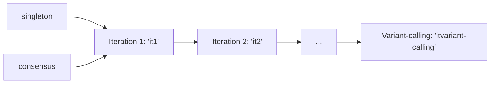
```mermaid
graph LR
    F[singleton] --> B[Iteration 1: 'it1']
    A[consensus] --> B[Iteration 1: 'it1']
    B --> C[Iteration 2: 'it2']
    C --> D[...]
    D --> E[Variant-calling: 'itvariant-calling']
```

The prefix of the sample is combined with the previous state of the sample. For example, in the first iteration (directory `iterations/it1`), reads will be mapped to the [reference-assisted de novo consensus sequence](./workflow/assembly_polishing.md) (_ie_ `consensus`) and so the output file will be `assembly/polishing/iterations/it1/bwamem2/bam/<sample-id>/<sample-id>_cl#_consensus.bam`.
:::

### Reference selection

The reference selection is done using [`Mash`](https://mash.readthedocs.io/en/latest/index.html) tool. Here the reference file is sketched (`variants/mapping-info/mash/sketch`) and compared to the reads (`variants/mapping-info/mash/screen`) where the reference with the highest estimated average nucleotide identity (ANI) and shared hashes is selected (`variants/mapping-info/mash/select-ref`).

:::note{title="Output files" collapse}

- `variants/mapping-info/mash`
  - `sketch/<sample-id>_<constraint-id>.msh`: The sketch file of the reads.
  - `screen/<sample-id>_<constraint-id>.screen`: The tab results file of the comparisons between references and reads.
  - `select-ref/<sample-id>_<constraint-id>.json`: The reference with the highest estimated ANI and shared hashes.

:::

:::info{title="Column names: mash-screen" collapse}

- identity
- shared-hashes
- median-multiplicity
- p-value
- query-ID
- query-comment

:::

### Read mapping

The mapping results are stored in the directory `variants/mapping-info/` or in the iterations directory `assembly/polishing/iterations/it#`.

If Bowtie2 is used, the output from the raw mapping results (in addition to the results after deduplication) are included in the multiqc report.

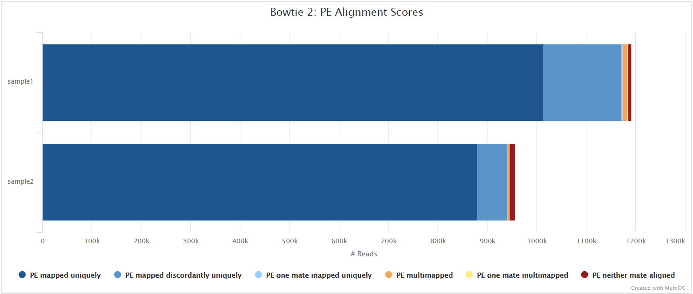

:::note{title="Output files - variants" collapse}

- `variants/mapping-info/`
  - `bwamem2/`
    - `index/<sample-id>_<constraint-id>/*`: The index files of the consensus.
    - `bam/<sample-id>/<sample-id>_<constraint-id>-CONSTRAINT.bam`: A BAM file containing the alignment of contigs to the consensus.
    - `unmapped/<sample-id>/<sample-id>_<constraint-id>-CONSTRAINT.fastq.gz`: A fastq file containing the unmapped reads.
  - `bwamem/`
    - `index/<sample-id>_<constraint-id>/*`: The index files of the consensus.
    - `bam/<sample-id>/<sample-id>_<constraint-id>-CONSTRAINT.bam`: A BAM file containing the alignment of contigs to the consensus.
    - `unmapped/<sample-id>/<sample-id>_<constraint-id>-CONSTRAINT.fastq.gz`: A fastq file containing the unmapped reads.
  - `bowtie2/`
    - `build/<sample-id>_<constraint-id>/*`: The index files of the consensus.
    - `bam/<sample-id>/<sample-id>_<constraint-id>-CONSTRAINT.bam`: A BAM file containing the alignment of contigs to the consensus.
    - `unmapped/<sample-id>/<sample-id>_<constraint-id>-CONSTRAINT.fastq.gz`: A fastq file containing the unmapped reads.
    - `log/<sample-id>_<constraint-id>-CONSTRAINT.log`: A log file of the bowtie2 run.

:::

:::note{title="Output files - iterations" collapse}

- `assembly/polishing/iterations/it#/`
  - `bwamem2/`
    - `index/<sample-id>/*`: The index files of the consensus.
    - `bam/<sample-id>/<sample-id>_cl#_it#.bam`: A BAM file containing the alignment of contigs to the consensus.
    - `unmapped/<sample-id>/<sample-id>_cl#_it#.fastq.gz`: A fastq file containing the unmapped reads.
  - `bowtie2/`
    - `build/<sample-id>/*`: The index files of the consensus.
    - `bam/<sample-pid>/<sample-id>_cl#_it#.bam`: A BAM file containing the alignment of contigs to the consensus.
    - `unmapped/<sample-id>/<sample-id>_cl#_it#.fastq.gz`: A fastq file containing the unmapped reads.
    - `log/<sample-id>_cl#_it#.log`: A log file of the bowtie2 run.

:::

By default read pairs with both ends unmapped are dropped (`samtools view -G 12`) from the alignments carried into deduplication, variant calling and consensus generation, leaving pairs intact. Because the pipeline maps up to five times per sample (`--iterative_refinement_cycles` plus the final round), this cuts alignment storage substantially on large runs. Set `--keep_unmapped` to carry the full alignment through those steps. The contig-coverage alignment behind `--perc_reads_contig` drops every unmapped read instead (`samtools view -F 4`), as only its per-contig mapped counts are used.

### Deduplication

To accommodate for PCR duplicates, the reads are deduplicated. The deduplication results are stored in the directory `variants/mapping-info/deduplicate/` or in the iterations directory `assembly/polishing/iterations/it#/deduplicate`.

Deduplication results are also visualized within the MultiQC report.

#### UMI-tools

[`UMI-tools`](https://umi-tools.readthedocs.io/en/latest/QUICK_START.html) is a set of tools for handling Unique Molecular Identifiers (UMIs) in NGS data. The deduplication is done by the `dedup` tool.

**Number of deduplicated reads**:
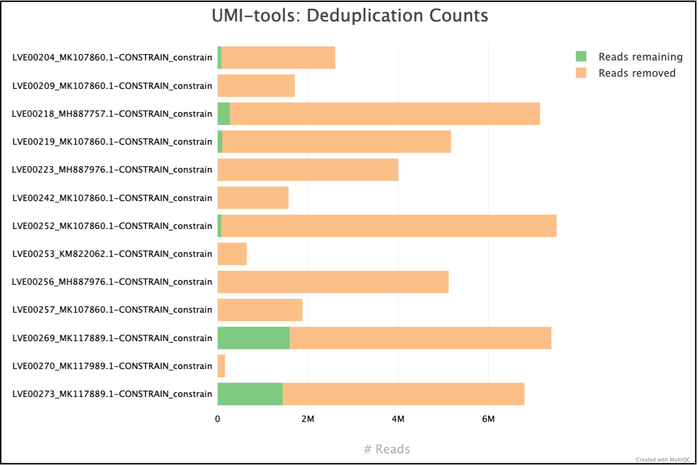

**Summary statistics**:
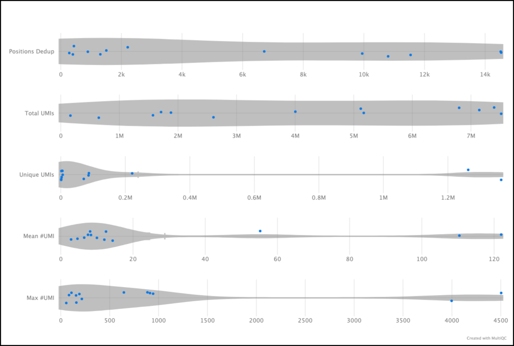

:::note{title="Output files - variants" collapse}

- `variants/mapping-info/deduplicate/`
  - `bam/<sample-id>/<sample-id>_<constraint-id>-CONSTRAINT.umi_deduplicated.bam`: A BAM file containing the alignment of contigs to the consensus.
  - `log/`
    - `<sample-id>_<constraint-id>-CONSTRAINT.umi_deduplicated.log`: A log file of the UMI-tools run.
    - `<sample-id>_<constraint-id>-CONSTRAINT.umi_deduplicated_edit_distance.tsv`: Reports the (binned) average edit distance between the UMIs at each position.
    - `<sample-id>_<constraint-id>-CONSTRAINT.umi_deduplicated_per_umi.tsv`: UMI-level summary statistics.
    - `<sample-id>_<constraint-id>-CONSTRAINT.umi_deduplicated_per_umi_per_position.tsv`: Tabulates the counts for unique combinations of UMI and position.

:::

:::note{title="Output files - iterations" collapse}

- `assembly/polishing/iterations/it#/deduplicate`
  - `bam/<sample-id>/<sample-id>_cl#_it#.umi_deduplicated.bam`: A BAM file containing the alignment of contigs to the consensus.
  - `log/`
    - `<sample-id>_cl#_it#.umi_deduplicated.log`: A log file of the UMI-tools run.
    - `<sample-id>_cl#_it#.umi_deduplicated_edit_distance.tsv`: Reports the (binned) average edit distance between the UMIs at each position.
    - `<sample-id>_cl#_it#.umi_deduplicated_per_umi.tsv`: UMI-level summary statistics.
    - `<sample-id>_cl#_it#.umi_deduplicated_per_umi_per_position.tsv`: Tabulates the counts for unique combinations of UMI and position.

:::

#### Picard - Mark Duplicates

[`Picard`](https://broadinstitute.github.io/picard/) is a set of command line tools for manipulating high-throughput sequencing data and formats such as SAM/BAM/CRAM and VCF. The deduplication is done by the `MarkDuplicates` tool.

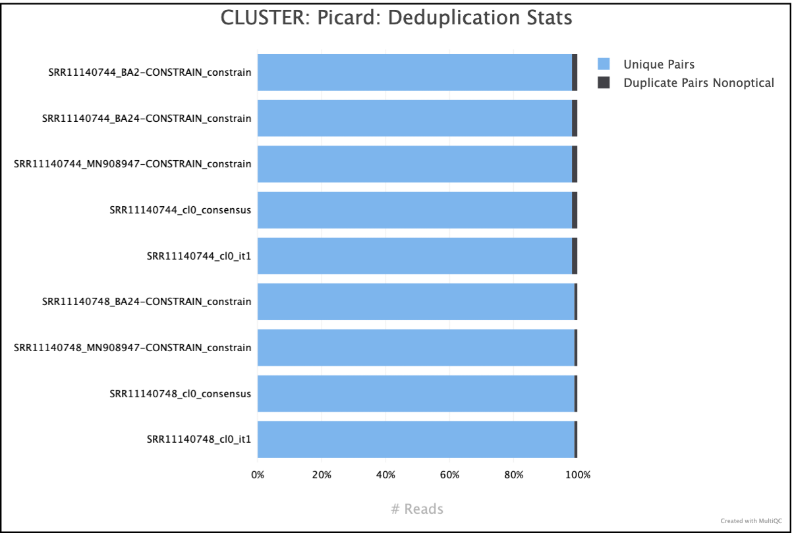

:::note{title="Output files - variants" collapse}

- `variants/mapping-info/deduplicate/`
  - `picard/`
    - `bam/<sample-id>/<sample-id>_<constraint-id>-CONSTRAINT.bam`: A BAM file containing the alignment of contigs to the consensus.
    - `log/<sample-id>_<constraint-id>-CONSTRAINT.dedup.MarkDuplicates.metrics.txt`: Deduplication metrics from Picard.

:::

:::note{title="Output files - iterations" collapse}

- `assembly/polishing/iterations/it#/deduplicate`
  - `picard/`
    - `bam/<sample-id>/<sample-id>_cl#_it#.bam`: A BAM file containing the alignment of contigs to the consensus.
    - `log/<sample-id>_cl#_it#.dedup.MarkDuplicates.metrics.txt`: Deduplication metrics from Picard.

:::

### Mapping statistics

:::info
If `--deduplicate` is set to `true` [default], all metrics will be calculated on the deduplicated bam file.
:::

#### Samtools

[Samtools](http://www.htslib.org/) is a suite of programs for interacting with high-throughput sequencing data. We use samtools in this pipeline to obtain mapping statistics from three tools: `flagstat`, `idxstats` and `stats`.

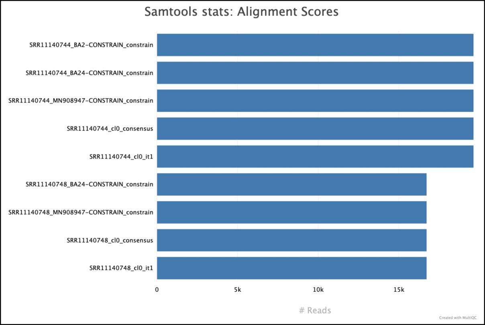
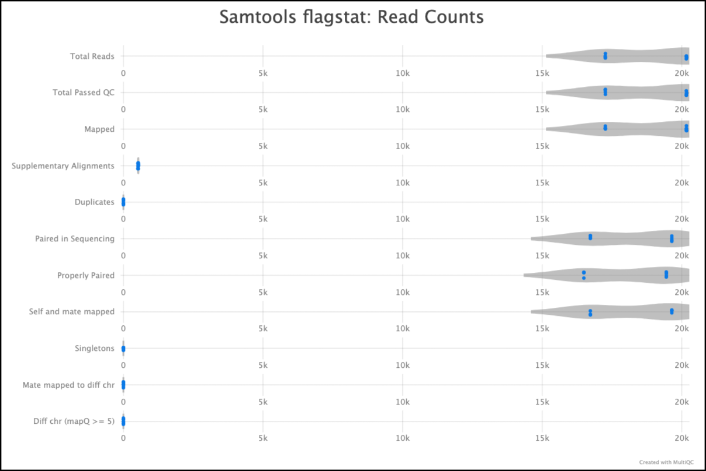

:::note{title="Output files - variants" collapse}

- `variants/mapping-info/metrics`
  - `flagstat/<sample-id>_<constraint-id>-CONSTRAINT.flagstat`: A text file containing the flagstat output.
  - `idxstats/<sample-id>_<constraint-id>-CONSTRAINT.idxstats`: A text file containing the idxstats output.
  - `stats/<sample-id>_<constraint-id>-CONSTRAINT.stats`: A text file containing the stats output.

:::

:::note{title="Output files - iterations" collapse}

- `assembly/polishing/iterations/it#/metrics`
  - `flagstat/<sample-id>_cl#_it#.flagstat`: A text file containing the flagstat output.
  - `idxstats/<sample-id>_cl#_it#.idxstats`: A text file containing the idxstats output.
  - `stats/<sample-id>_cl#_it#.stats`: A text file containing the stats output.

:::

#### Picard - Collect Multiple Metrics

[`Picard`](https://broadinstitute.github.io/picard/) is a set of command line tools for manipulating high-throughput sequencing data. We use picard-tools in this pipeline to obtain mapping and coverage metrics.

:::note{title="Output files - variants" collapse}

- `variants/mapping-info/metrics/picard`
  - `*.CollectMultipleMetrics.*`: Alignment QC files from picard CollectMultipleMetrics in `*_metrics` textual format.
  - `*.pdf` plots for metrics obtained from CollectMultipleMetrics.

:::

:::note{title="Output files - iterations" collapse}

- `assembly/polishing/iterations/it#/metrics/picard`
  - `*.CollectMultipleMetrics.*`: Alignment QC files from picard CollectMultipleMetrics in `*_metrics` textual format.
  - `*.pdf` plots for metrics obtained from CollectMultipleMetrics.

:::

#### Custom - mpileup like file

To facilitate the intra host analysis, a mpileup like file is generated. This file contains the depth of every nucleotide at each position of the reference as well as the shannon entropy and a weighted shannon entropy based on the following formulae.

- Shannon entropy: $$ H = -\sum\_{i=1}^4 p_i \ln p_i $$
- Weighted Shannon entropy: $$ w(H) = \frac{N}{N+k} \cdot H $$

Where $N$ is the total bases at a position, $k$ is the pseudocount (default 50), and $p_i$ is the frequency of the nucleotide $i$.

:::note{title="Output files - variants" collapse}

- `variants/mapping-info/custom-vcf/<sample-id>`
  - `*.tsv`: A custom tsv file containing the depth of every nucleotide at each position of the reference.

:::

:::note{title="Output files - iterations" collapse}

- `assembly/polishing/iterations/it#/custom-vcf/<sample-id>`
  - `*.tsv`: A custom tsv file containing the depth of every nucleotide at each position of the reference.

:::

#### Mosdepth - Coverage

[mosdepth](https://github.com/brentp/mosdepth) is a fast BAM/CRAM depth calculation for WGS, exome, or targeted sequencing. mosdepth is used in this pipeline to obtain genome-wide coverage values in 200bp windows. The results are rendered in MultiQC (genome-wide coverage).

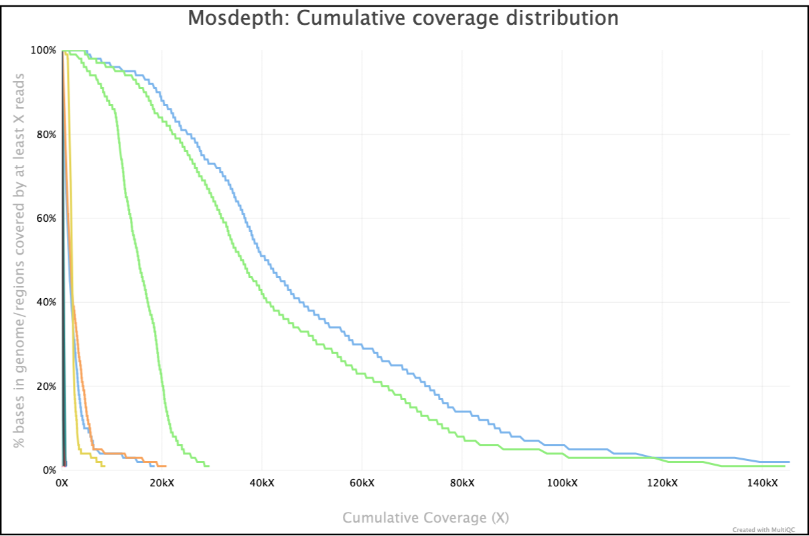
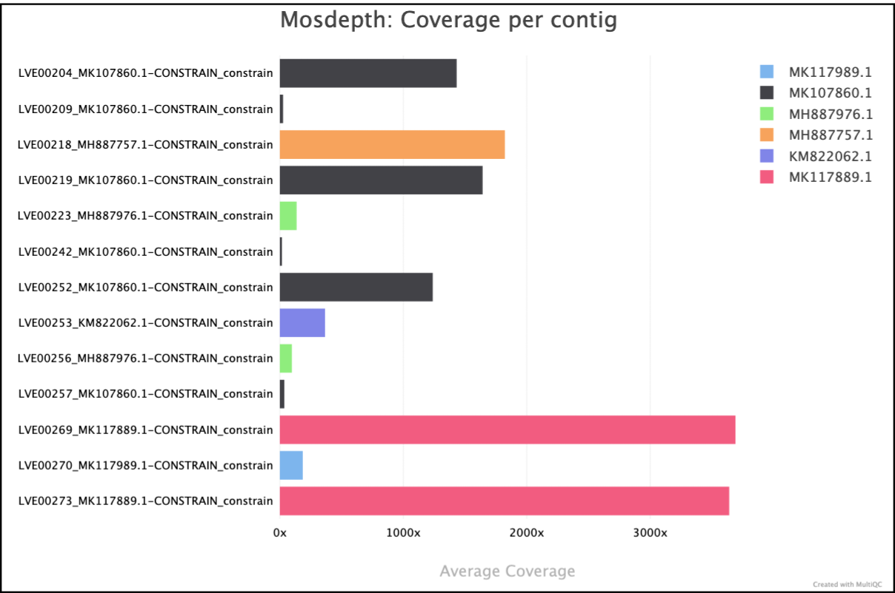

:::note{title="Output files - variants" collapse}

- `variants/mapping-info/metrics/mosdepth`
  - `<sample-id>_<constraint-id>-CONSTRAINT.per-base.bed.gz`: A bed file containing the coverage values in 200bp windows.
  - `<sample-id>_<constraint-id>-CONSTRAINT.per-base.bed.gz.csi`: Indexed bed file.
  - `<sample-id>_<constraint-id>-CONSTRAINT.mosdepth.summary.txt`: Summary metrics including mean, min and max coverage values.
  - `<sample-id>_<constraint-id>-CONSTRAINT.mosdepth.global.dist.txt`: A cumulative distribution indicating the proportion of total bases that were covered for at least a given coverage value.

:::

:::note{title="Output files - iterations" collapse}

- `assembly/polishing/iterations/it#/metrics/mosdepth`
  - `<sample-id>_cl#_it#.per-base.bed.gz`: A bed file containing the coverage values in 200bp windows.
  - `<sample-id>_cl#_it#.per-base.bed.gz.csi`: Indexed bed file.
  - `<sample-id>_cl#_it#.mosdepth.summary.txt`: Summary metrics including mean, min and max coverage values.
  - `<sample-id>_cl#_it#.mosdepth.global.dist.txt`: A cumulative distribution indicating the proportion of total bases that were covered for at least a given coverage value.

:::

### Variant calling & filtering

Variant calling is done with [`BCFtools mpileup`](http://samtools.github.io/bcftools/bcftools.html) or [`iVar`](https://andersen-lab.github.io/ivar/html/manualpage.html), the filtering with `BCFtools filter`.

Variant files are visualized in the MultiQC report.

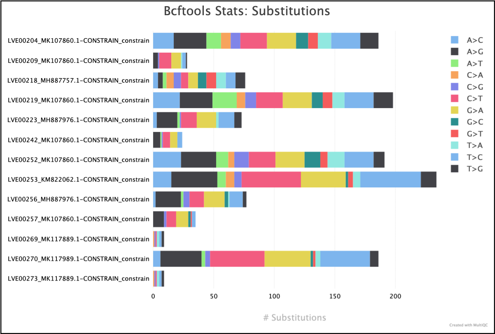

:::note{title="Output files - variants" collapse}

- `variants/variant_calling`
  - `bcftools/`
    - `<sample-id>/<sample-id>_<constraint-id>-CONSTRAINT.vcf.gz`: A VCF file containing the variant calls.
    - `<sample-id>/<sample-id>_<constraint-id>-CONSTRAINT.norm.vcf.gz`: A compressed VCF file where multiallelic sites are split up into biallelic records and SNPs and indels should be merged into a single record.
    - `<sample-id>/<sample-id>_<constraint-id>-CONSTRAINT.filtered.vcf.gz`: A compressed VCF file containing the filtered variants.
    - `<sample-id>/<sample-id>_<constraint-id>-CONSTRAINT.vcf.gz.tbi`: An index file for the compressed VCF file.
    - `<sample-id>/<sample-id>_<constraint-id>-CONSTRAINT_stats.txt`: A text file stats which is suitable for machine processing and can be plotted using plot-vcfstats.
  - `ivar/`
    - `<sample-id>/<sample-id>_<constraint-id>-CONSTRAINT.ivar.tsv`: A tabular file containing the variant calls.
    - `<sample-id>/<sample-id>_<constraint-id>-CONSTRAINT.ivar.vcf`: A VCF file containing the variant calls.
    - `<sample-id>/<sample-id>_<constraint-id>-CONSTRAINT.ivar.variant_counts.log`: A summary file containing the number of indels and SNPs.
    - `<sample-id>/<sample-id>_<constraint-id>-CONSTRAINT.filtered.vcf.gz`: A compressed VCF file containing the variant calls.
    - `<sample-id>/<sample-id>_<constraint-id>-CONSTRAINT_stats.txt`: A text file stats which is suitable for machine processing and can be plotted using plot-vcfstats.

:::

:::note{title="Output files - iterations" collapse}

- `assembly/polishing/iterations/it#/variants/variant_calling`
  - `bcftools/`
    - `<sample-id>/<sample-id>_cl#_it#.vcf.gz`: A VCF file containing the variant calls.
    - `<sample-id>/<sample-id>_cl#_it#.norm.vcf.gz`: A compressed VCF file where multiallelic sites are split up into biallelic records and SNPs and indels should be merged into a single record.
    - `<sample-id>/<sample-id>_cl#_it#.filtered.vcf.gz`: A compressed VCF file containing the filtered variants.
    - `<sample-id>/<sample-id>_cl#_it#.vcf.gz.tbi`: An index file for the compressed VCF file.
    - `<sample-id>/<sample-id>_cl#_it#.stats.txt`: A text file stats which is suitable for machine processing and can be plotted using plot-vcfstats.
  - `ivar/`
    - `<sample-id>_cl#_it#.ivar.tsv`: A tabular file containing the variant calls.
    - `<sample-id>/<sample-id>_cl#_it#.ivar.vcf`: A VCF file containing the variant calls.
    - `<sample-id>/<sample-id>_cl#_it#.ivar.variant_counts.log`: A summary file containing the number of indels and SNPs.
    - `<sample-id>/<sample-id>_cl#_it#.filtered.vcf.gz`: A compressed VCF file containing the variant calls.
    - `<sample-id>/<sample-id>_cl#_it#.stats.txt`: A text file stats which is suitable for machine processing and can be plotted using plot-vcfstats.

:::

### Variant annotation

Variant annotation is performed with [`SnpEff`](https://pcingola.github.io/SnpEff/) to predict the functional effects of identified variants, and [`SnpSift`](https://pcingola.github.io/SnpEff/SnpSift.html) to extract information from the annotated variants into a tabular format.

:::note{title="Output files" collapse}

- `variants/annotation/`
  - `<sample-id>/<sample-id>_<constraint-id>-CONSTRAINT.ann.vcf.gz`: A VCF file with annotated variants showing their predicted functional effects.
  - `<sample-id>/<sample-id>_<constraint-id>-CONSTRAINT.csv`: A CSV file with statistics about the variant annotation.
  - `<sample-id>/<sample-id>_<constraint-id>-CONSTRAINT.genes.txt`: A text file with gene-level statistics.
  - `<sample-id>/<sample-id>_<constraint-id>-CONSTRAINT.summary.html`: An HTML summary of the variant annotation statistics.
  - `<sample-id>/<sample-id>_<constraint-id>-CONSTRAINT.snipsift.table.txt`: A tabular file containing extracted fields from the annotated variants, making the information more accessible for analysis.

:::

The SnpEff annotation provides valuable information about variants, including:

- Variant type (SNP, insertion, deletion)
- Impact (HIGH, MODERATE, LOW, MODIFIER)
- Gene name and ID affected by the variant
- Type of effect (missense, synonymous, frameshift, etc.)
- Changes at the amino acid level (protein impact)
- Location within gene features (exon, intron, etc.)

> [!NOTE]
> By default, variant annotation is enabled. It can be skipped with `--skip_vcf_annotation`.

### Consensus generation

The consensus sequences are generated by [`BCFtools`](http://samtools.github.io/bcftools/bcftools.html) or [`iVar`](https://andersen-lab.github.io/ivar/html/manualpage.html). The consensus sequences are stored in the directory `consensus/` or in the iterations directory `assembly/polishing/iterations/it#/consensus`.

`BCFtools` will use the filtered variants file whereas, `iVar` will redetermine the variants to collapse in the consensus using their own workflow, read more about their differences in the [consensus calling section](./workflow/variant_and_refinement.md#4-consensus-calling).

:::note{title="Output files - iterations & variants" collapse}

- `consensus`
  - `seq/<it# | scaffold_consensus | variant-calling | constraint>/ `
    - `<sample-id>/*.fasta`: A fasta file containing the consensus sequence.
  - `mask/<it# | variant-calling | constraint>`
    - `<sample-id>/*.qual.txt`: A log file of the consensus run containing statistics. [`iVar` only]
    - `<sample-id>/*.bed`: A bed file containing the masked regions. [`BCFtools` only]
    - `<sample-id>/*.mpileup`: A mpileup file containing information on the depth and the quality of each aligned base.

:::

## Consensus Quality control

Consensus quality control is done with multiple tools, the results are stored in the directory `consensus/quality_control/`.

### Quast

[QUAST](http://quast.sourceforge.net/) is a quality assessment tool for genome assemblies. It calculates various metrics such as N50, L50, number of contigs, number of mismatches, number of indels, etc.

:::note{title="Output files" collapse}

- `consensus/quality_control/quast/`
  - `<sample-id>/<iteration>/<sample-id>_<cl# | constraint-id>.tsv`: A tabular file containing the QUAST report.

:::

> [!NOTE]
> If no iterative refinement was run, the output will be in the `consensus/quality_control/quast/<sample-id>/constraint` directory.

### CheckV

[`CheckV`](https://bitbucket.org/berkeleylab/checkv/src/master/) is a tool for assessing the quality of viral genomes recovered from metagenomes. It calculates various metrics such as the number of viral genes, the number of viral contigs, the number of viral genomes, etc.

:::note{title="Output files" collapse}

- `consensus/quality_control/checkv/`
  - `<sample-id>/<sample-id>_<cl# | constraint-id>/quality_summary.tsv`: A tabular file that integrates the results from the three main modules of checkv and should be the main output referred to.
  - `<sample-id>/<sample-id>_<cl# | constraint-id>/completeness.tsv`: A detailed overview of how completeness was estimated.
  - `<sample-id>/<sample-id>_<cl# | constraint-id>/contamination.tsv`: A detailed overview of how contamination was estimated.
  - `<sample-id>/<sample-id>_<cl# | constraint-id>/complete_genomes.tsv`: A detailed overview of putative genomes identified.

:::

### Prokka

[`Prokka`](https://github.com/tseemann/prokka) is a whole genome annotation pipeline for identifying features of interest in a set of genomic DNA sequences, and labelling them with useful information. Prokka is a software tool to annotate bacterial, archaeal and viral genomes.

:::note{title="Output files" collapse}

- `consensus/quality_control/prokka/<sample-id>/<iteration>/`
  - `*.gff`: This is the master annotation in GFF3 format, containing both sequences and annotations. It can be viewed directly in Artemis or IGV.
  - `*.gbk`: This is a standard Genbank file derived from the master .gff. If the input to prokka was a multi-FASTA, then this will be a multi-Genbank, with one record for each sequence.
  - `*.fna`: Nucleotide FASTA file of the input contig sequences.
  - `*.faa`: Protein FASTA file of the translated CDS sequences.
  - `*.ffn`: Nucleotide FASTA file of all the prediction transcripts (CDS, rRNA, tRNA, tmRNA, misc_RNA)
  - `*.sqn`: An ASN1 format "Sequin" file for submission to Genbank. It needs to be edited to set the correct taxonomy, authors, related publication etc.
  - `*.fsa`: Nucleotide FASTA file of the input contig sequences, used by "tbl2asn" to create the .sqn file. It is mostly the same as the .fna file, but with extra Sequin tags in the sequence description lines.
  - `*.tbl`: Feature Table file, used by "tbl2asn" to create the .sqn file.
  - `*.err`: Unacceptable annotations - the NCBI discrepancy report.
  - `*.log`: Contains all the output that Prokka produced during its run. This is a record of what settings you used, even if the --quiet option was enabled.
  - `*.txt`: Statistics relating to the annotated features found.
  - `*.tsv`: Tab-separated file of all features: locus_tag,ftype,len_bp,gene,EC_number,COG,product

:::

### BLASTn

[BLAST](https://blast.ncbi.nlm.nih.gov/Blast.cgi) is a tool for comparing primary biological sequence information. The output from the BLAST run is stored in the directory `consensus/quality_control/blast/`. Final consensus genomes are searched against the `--reference_pool`.

:::info{title="Column names" collapse}

- qseqid
- sseqid
- stitle
- pident
- qlen
- slen
- length
- mismatch
- gapopen
- qstart
- qend
- sstart
- send
- evalue
- bitscore

:::

:::tip{title= "Modifying blast columns"}

Modifying these columns can be done through a custom config file and by updating `bin/utils/constant_variables.py`.

:::

:::note{title="Output files" collapse}

- `consensus/quality_control/blast/` A tabular file containing the BLAST report of all intermediate & final results.

:::

### MMseqs-search (annotation)

[MMseqs-search](https://github.com/soedinglab/MMseqs2/wiki#searching) is an ultra-fast and sensitive search tool for protein and nucleotide databases. nf-core/viralmetagenome uses MMseqs to search the consensus genomes in an annotated database, like [Virosaurus](https://virosaurus.vital-it.ch/) (see also [defining your own custom annotation database](usage/databases.md#annotation-sequences)), and uses the annotation data of the best hit to assign the consensus genome a species name, segment name, expected host, and any other metadata that describes the database sequences - taken from a metadata table when `--annotation_metadata` is given, and from the fasta headers otherwise.

:::info{title="Column names" collapse}

- qseqid
- sseqid
- stitle
- pident
- qlen
- slen
- length
- mismatch
- gapopen
- qstart
- qend
- sstart
- send
- evalue
- bitscore

:::

:::tip{title="Modifying mmseqs columns"}

Modifying these columns can be done through a custom config file and by updating `bin/utils/constant_variables.py`.

:::

:::note{title="Output files" collapse}

- `consensus/quality_control/mmseqs-search/all_genomes_annotation.hits.tsv`: A tabular file containing the MMseqs-search hits, all genomes are combined to reduce the number of jobs.

:::

### MAFFT

[MAFFT](https://mafft.cbrc.jp/alignment/software/) is a multiple sequence alignment program for amino acid or nucleotide sequences. The output from the MAFFT run is stored in the directory `consensus/quality_control/mafft/`.

It is used to align the following genomic data:

- The final consensus genome
- The identified reference genome from `--reference_pool`
- The denovo contigs from each assembler (that constituted the final consensus genome)
- Each consensus genome from the iterative refinement steps.

:::note{title="Output files" collapse}

- `consensus/quality_control/mafft/`
  - `<sample-id>/<sample_id>_cl#_iterations.fas`: A fasta file containing a multiple sequence alignment of only the iterations.
  - `<sample-id>/<sample_id>_cl#_aligned.fas`: A fasta file containing a multiple sequence alignment of the denovo contigs, the reference from reference_pool and the consensus from iterations.

:::

Alignment can then be opened with MSA viewer, for example Jalview

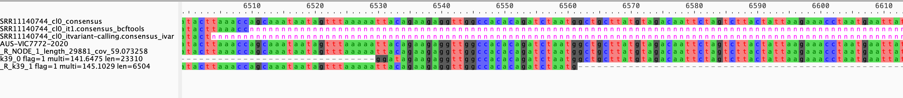

## MultiQC

[MultiQC](http://multiqc.info) is a visualization tool that generates a single HTML report summarizing all samples in your project. Most of the pipeline QC results are visualized in the report and further statistics are available in the report data directory.

Results generated by MultiQC collate pipeline QC from supported tools e.g. FastQC. The pipeline has special steps which also allow the software versions to be reported in the MultiQC output for future traceability. For more information about how to use MultiQC reports, see <http://multiqc.info>. For an example report, see the [example output](https://github.com/nf-core/viralmetagenome/tree/dev/assets/test_full-multiqc_report.html).

Furthermore, nf-core/viralmetagenome runs MultiQC 2 times, as it uses the output from multiqc to create multiple summary tables of the consensus genomes and their iterations.

The report also includes a "Contig clusters" section with two plots, both aggregated per sample and species (never per contig, which would bloat the static page).

**Taxonomic classification** is a stacked bar chart, similar to the read-level Kaiju/Kraken2 bar charts, of the final consensus clusters per sample coloured by the species of their best [MMseqs-search (annotation)](#mmseqs-search-annotation) hit. Only the five most abundant species get their own colour - a legend runs out of distinguishable colours quickly - and the rest are grouped as "Other species", with clusters that had no significant hit as "Unclassified". The "All clusters" view adds a grey "Not reconstructed" segment that completes each bar to the number of clusters the sample started with, so the plot shows both what was found and what was lost during coverage filtering and refinement. Switch to "Reconstructed clusters" to drop that segment.

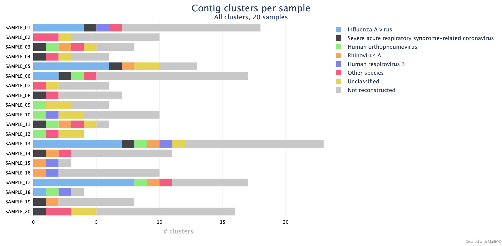

**Genome completeness** is a heatmap of the median consensus genome completeness per sample and species, naming the ten most abundant species rather than five, since a column only costs width. Completeness is CheckV's `completeness` estimate when CheckV ran; otherwise it is estimated as the fraction of the annotation hit's reference genome that the consensus spans, discounted by the ambiguous bases QUAST counted. An empty cell means the species was not reconstructed in that sample, and clusters whose best hit carries no species are collected in an "Unclassified" column. Segmented viruses get a column per segment (`Influenza A virus | seg 4`), so a partially recovered multipartite genome reads as the segments it is missing rather than as one averaged number - see [annotation sequences](usage/databases.md#annotation-sequences) for the metadata fields this is read from.

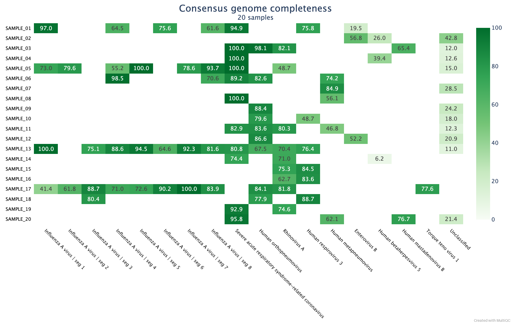

> [!NOTE]
> Both screenshots come from an example run with several species, one of them segmented, to show the layout the plots take on a diverse dataset.

Both plots are drawn whenever the run produced contig clusters. Without annotation - `--skip_consensus_annotation`, `--skip_consensus_qc`, or simply a database that returned no hit - every cluster falls into "Unclassified", so the plots still report how many clusters each sample yielded and how complete they are.

:::note{title="Output files Multiqc" collapse}

- `multiqc/`
  - `multiqc_report.html`: a standalone HTML file that can be viewed in your web browser.
  - `multiqc_data/`: directory containing parsed statistics from the different tools used in the pipeline.
  - `multiqc_data/contig_taxonomy*.txt`: cluster counts per sample and species, underlying the "Taxonomic classification" bar chart.
  - `multiqc_data/contig_completeness.txt`: mean consensus genome completeness per sample and species, underlying the "Genome completeness" heatmap.
  - `multiqc_plots/`: directory containing static images from the report in various formats.

:::

:::note{title="Custom overview tables" collapse}

- `overview-tables/`: a directory with a set of summary TSV files.
  - `contigs_overview_with_iterations.tsv`: A tabular file containing the contig information of the final **contig consensus** genome and their intermediate iterations.
  - `contigs_overview.tsv`: A tabular file containing the contig information of the final **contig consensus** genome.
  - `mapping_overview.tsv`: A tabular file containing the mapping information of the final **mapped consensus** genome, from the argument `--mapping_constraints`.
  - `samples_overview.tsv`: A tabular file containing the sample information combining information from both `contigs_overview.tsv` & `mapping_overview.tsv`.

:::

:::note{title="Output files" collapse}

- `pipeline_info/`
- Reports generated by Nextflow: `execution_report.html`, `execution_timeline.html`, `execution_trace.txt` and `pipeline_dag.dot`/`pipeline_dag.svg`.
- Reports generated by the pipeline: `pipeline_report.html`, `pipeline_report.txt` and `software_versions.yml`. The `pipeline_report*` files will only be present if the `--email` / `--email_on_fail` parameter's are used when running the pipeline.
- Reformatted samplesheet files used as input to the pipeline: `samplesheet.valid.csv`.
- Parameters used by the pipeline run: `params.json`.

:::

[Nextflow](https://www.nextflow.io/docs/latest/tracing.html) provides excellent functionality for generating various reports relevant to the running and execution of the pipeline. This will allow you to troubleshoot errors with the running of the pipeline, and also provide you with other information such as launch commands, run times and resource usage.
