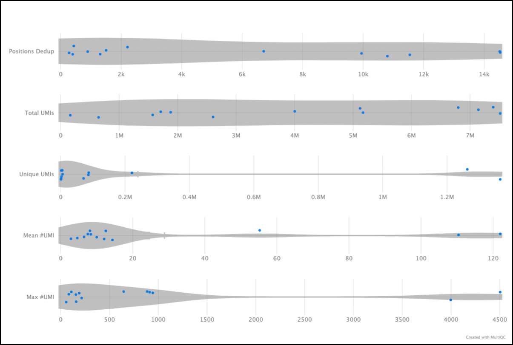
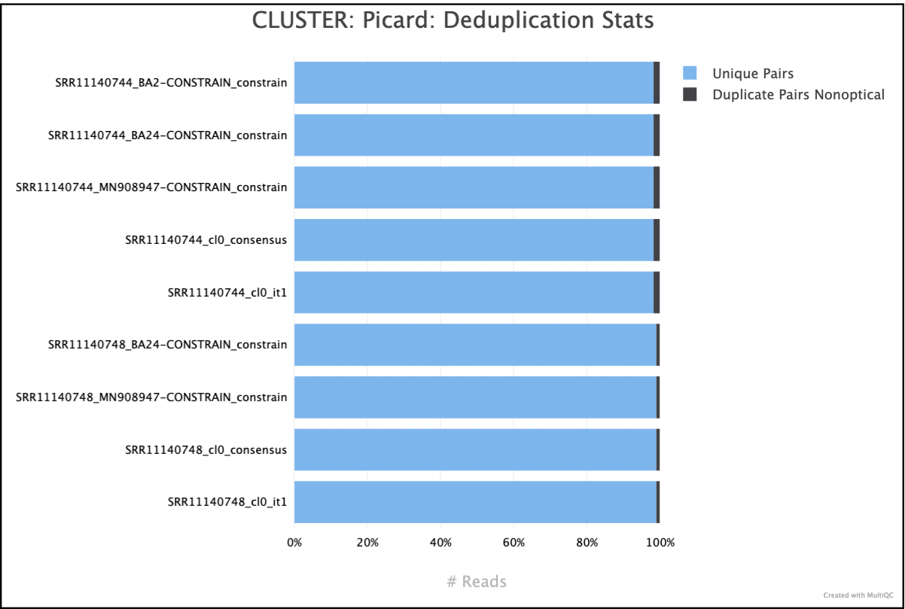
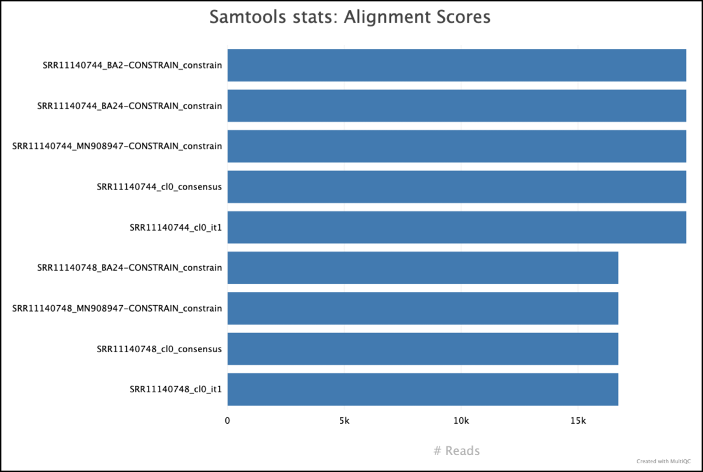
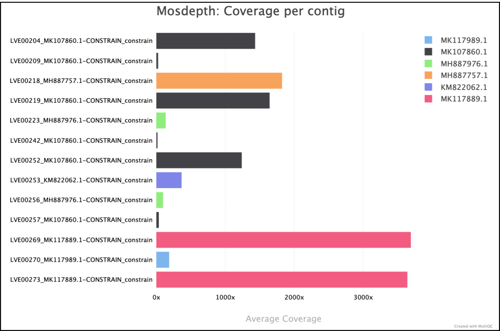

# Output

## Introduction

This document describes the output produced by the pipeline. Most of the plots are taken from the MultiQC report, which summarises results at the end of the pipeline.

The directories listed below will be created in the results directory after the pipeline has finished. All paths are relative to the top-level results directory.

!!! Tip
    A global, partly, random prefix can be created using the argument `--prefix <string>`. The following string will then be used as a prefix to all output files.
    ```java
    "<prefix_string>_<date>_<pipeline_version>_<workflow_runName>"
    ```

## Preprocessing

All output files of the preprocessing steps can be found in the directory `preprocessing/`.
### FastQC

???- abstract "Output files"
    -   `fastqc/{raw,trim,host}`
        -   `*_fastqc.html`: FastQC report containing quality metrics.
        -   `*_fastqc.zip`: Zip archive containing the FastQC report, tab-delimited data file and plot images.

[FastQC](http://www.bioinformatics.babraham.ac.uk/projects/fastqc/) gives general quality metrics about your sequenced reads. It provides information about the quality score distribution across your reads, per base sequence content (%A/T/G/C), adapter contamination and overrepresented sequences. For further reading and documentation see the [FastQC help pages](http://www.bioinformatics.babraham.ac.uk/projects/fastqc/Help/).


!!! Tip
    The FastQC plots displayed in the MultiQC report shows _untrimmed_, _trimmed_ and _host filtered_ reads. Make sure to check the section titles for the correct set of reads.

### fastp

[fastp](https://github.com/OpenGene/fastp) is a FASTQ pre-processing tool for quality control, trimmming of adapters, quality filtering and other features.

???- abstract "Output files"

    - `fastp/`
        - `report/<sample-id>.*{html,json}`: report files in different formats.
        - `log/<sample-id>.*{html,json}`: log files.
        - `<sample-id>.fastp.fastq.gz`: file with the trimmed fastq reads.
        - `fail/<sample-id>.fail.fastq.gz`: file with reads that didn't suffice quality controls.

By default viralgenie will only provide the report and log files if fastp is selected. The trimmed reads can be saved by specifying `--save_intermediate_reads` or `--save_final_reads 'trimming'`. Similarly, the saving of the output reads can be enabled with `--save_trimmed_fail`.

### Trimmomatic
[Trimmomatic](http://www.usadellab.org/cms/?page=trimmomatic) is a FASTQ pre-processing tool for quality control, trimmming of adapters, quality filtering and other features.

???- abstract "Output files"

    - `trimmomatic/`
        - `<sample-id>.fastq.gz`: file with the trimmed fastq reads.
        - `log/<sample-id>.*{html,txt,zip}`: log files generated by trimmomatic.

By default viralgenie will only provide the report and log files if Trimmomatic is selected. The trimmed reads can be saved by specifying `--save_intermediate_reads` or `--save_final_reads 'trimming'`.

### UMI-deduplication

UMI-deduplication can be done at the read level using [`HUMID`](https://humid.readthedocs.io/en/latest/usage.html). Viralgenie also uses provides the opportunity to extract the UMI from the read using [`UMI-tools extract`](https://umi-tools.readthedocs.io/en/latest/QUICK_START.html#step-3--extract-the-umis) if the UMI is not in the header. Results will be stored in the `preprocessing/umi` directory.

???- abstract "Output files"

    - `umi/`
        - `humid/`
            - `log/<sample-id>.log`: log file of humid.
            - `annotated/<sample-id>_annotated_*.fastq.gz`: annotated FastQ files, reads will have their assigned cluster in the read header.
            - `deduplicated/<sample-id>_deduplicated_*.fastq.gz`: deduplicated FastQ files.
        - `umitools/`
            - `log/<sample-id>.log`: log file of umi-tools.
            - `extracts/<sample-id>.umi_extract*.fastq.gz`: fastq file where UMI's have been removed from the read and moved to the read header.

By default viralgenie will not assume reads have UMI's. To enable this use the parameter `--with_umi`. Specify where UMI deduplication should occur with `--umi_deduplicate` if at a `read` level, on a `mapping` level or `both` at a read and mapping level. The deduplicated reads can be saved by specifying `--save_intermediate_reads` or `--save_final_reads 'deduplication'`.

### BBDuk

[BBDuk](https://jgi.doe.gov/data-and-tools/software-tools/bbtools/bb-tools-user-guide/bbduk-guide/) stands for Decontamination Using Kmers. BBDuk was developed to combine most common data-quality-related trimming, filtering, and masking operations into a single high-performance tool.

It is used in viralgenie for complexity filtering using different algorithms. This means that it will remove reads with low sequence diversity (e.g. mono- or dinucleotide repeats).

???- abstract "Output files"

    - `bbduk/`
        - `log/<sample-id>.bbduk.log`: log file containing filtering statistics
        - `<sample-id>.fastq.gz`: resulting FASTQ file without low-complexity reads

By default viralgenie will only provide the log files of bbduk. The filtered reads can be saved by specifying `--save_intermediate_reads` or `--save_final_reads 'complexity'`.

### prinseq++

[`prinseq++`](https://github.com/Adrian-Cantu/PRINSEQ-plus-plus)

It is used in viralgenie for complexity filtering using different algorithms. This means that it will remove reads with low sequence diversity (e.g. mono- or dinucleotide repeats).

???- abstract "Output files"

    - `prinseq/`
        - `log/<sample-id>.log`: log file containing filtering statistics
        - `<sample-id>.fastq.gz`: resulting FASTQ file without low-complexity reads

By default viralgenie will only provide the log files of prinseq. The filtered reads can be saved by specifying `--save_intermediate_reads` or `--save_final_reads 'complexity'`.


### Hostremoval-Kraken2

[Kraken2](https://ccb.jhu.edu/software/kraken2/) is a taxonomic sequence classifier that assigns taxonomic labels to DNA sequences. Kraken examines the k-mers within a query sequence and uses the information within those k-mers to query a database. That database maps -mers to the lowest common ancestor (LCA) of all genomes known to contain a given k-mer.

???- abstract "Output files"

    - `hostremoval-kraken2/`
        * `<sample-id>_kraken2_host.report.txt`: A profile of the aligned reads to a given host contamination database.
        * `<sample-id>_kraken2_host.unclassified*.fastq.gz`: resulting FASTQ file with reads that don't have any matches to the given host contamination database.


By default viralgenie will only provide the log files of kraken2 which are visualised in [Multiqc](#multiqc). The filtered reads can be saved by specifying `--save_intermediate_reads` or `--save_final_reads 'host'`.

## Metagenomic Diversity

The results of the metagenomic diversity analysis are stored in the directory `metagenomic_diversity/`. Results are also visualised in the MultiQC report.


### Kraken2
[Kraken](https://ccb.jhu.edu/software/kraken2/) is a taxonomic sequence classifier that assigns taxonomic labels to DNA sequences. Kraken examines the k-mers within a query sequence and uses the information within those k-mers to query a database. That database maps -mers to the lowest common ancestor (LCA) of all genomes known to contain a given k-mer.

???- abstract "Output files"

    - `metagenomic_diversity/kraken2/`

        - `<sample-id>.report.txt`:A Kraken2 report that summarises the fraction abundance, taxonomic ID, number of Kmers, taxonomic path of all the hits in the Kraken2 run for a given sample. Will be 6 column rather than 8 if `--save_minimizers` specified.
        - `<sample-id>_kraken2_host.unclassified*.fastq.gz`: resulting FASTQ file with reads that don't have any matches to the given host contamination database.
        - `<sample-id>.classified.fastq.gz`: FASTQ file containing all reads that had a hit against a reference in the database for a given sample.
        - `<sample-id>.unclassified.fastq.gz`: FASTQ file containing all reads that did not have a hit in the database for a given sample.
        - `<sample-id>.classifiedreads.txt`: A list of read IDs and the hits each read had against the database for a given sample.

> By default viralgenie will provide any classified or unclassified fastq files, specify this with --kraken2_save_reads. Similarly for the classifiedreads table, specify this with --kraken2_save_readclassification.

### Kaiju
[Kaiju](https://kaiju.binf.ku.dk/) is a program for sensitive taxonomic classification of high-throughput sequencing reads from metagenomic data. It is based on the Burrows-Wheeler transform and the lowest common ancestor algorithm.

???- abstract "Output files"

    - `metagenomic_diversity/kaiju/`
        - `<sample-id>.tsv`: Raw output from Kaiju with taxonomic rank, read ID and taxonic ID
        - `<sample-id>.txt`: A summary of the taxonomic classification of the reads in the sample.

### Krona
[Krona](https://github.com/marbl/Krona/wiki) is a hierarchical data visualisation tool that can be used to visualise the taxonomic classification of metagenomic data.

???- abstract "Output files"

    - `metagenomic_diversity/krona/`
        - `<kaiju|kraken2>_.html`: A HTML file containing the Krona visualisation of the taxonomic classification of the reads in the sample.


{: .center}

## Assembly & Polishing

The results of the assembly processes & polishing are stored in the directory `assembly/`.

Multiple intermediate files can be genarated during the assembly process, some of them might not always be interesting to have. For this reason, there is an option to save the intermediate files with the `--save_intermediate_polishing` argument which is by default off.

### Assemblers

Multiple assemblers [spades, trinity, megahit] can be used which have their results combined. Each assembler has its own directory in the `assembly/assemblers` directory, where there will be a subfolder for the contigs and the QC results from quast.

???- abstract "Output files"

    -   `assemblers/`
        -   `spades/<spades_mode>/`
            -   `contigs/<sample-id>_spades.fa.gz`: Contigs generated by SPAdes.
            -  `log/<sample-id>_spades.log`: Directory containing the log file of the spades run.
            -   `quast/<sample-id>_spades.tsv`: Directory containing the QUAST report.
        -   `trinity/`
            -   `contigs/<sample-id>_trinity.fa.gz`: Contigs generated by Trinity.
            -   `quast/<sample-id>_trinity.tsv`: Directory containing the QUAST report.
        -   `megahit/`
            -   `contigs/<sample-id>_megahit.fa.gz`: Contigs generated by Megahit.
            -   `quast/<sample-id>_megahit.tsv`: Directory containing the QUAST report.

Quast results are also summarised and plotted in the MultiQC report.

{: .center}

Finally, the results of the assemblers are combined and stored in the `tools_combined/` directory.

???- abstract "Output files"

    - `assemblers`
        - `tools_combined/<sample-id>.combined.fa` : Contigs generated by combining the results of the assemblers.

### SSPACE Basic

[SSPACE Basic](https://github.com/nsoranzo/sspace_basic) is a tool for scaffolding contigs using paired-end reads. It is modified from SSAKE assembler and has the feature of extending contigs using reads that are unmappable in the contig assembly step.

???- abstract "Output files"

    - `sspace_basic/`
        - `scaffolds/<sample-id>.scaffolds.fasta`: Scaffolds generated by SSPACE Basic.
        - `log/<sample-id>.*.txt`: Various txt files containig log and summary information on the SSPACE Basic run.

### prinseq++ - contigs

[`prinseq++`](https://github.com/Adrian-Cantu/PRINSEQ-plus-plus) is used in for complexity filtering of contigs.

???- abstract "Output files"

    - `prinseq/`
        - `scaffolds/<sample-id>.scaffolds.fasta`: Scaffolds generated by SSPACE Basic.
        - `log/<sample-id>.*.txt`: Various txt files containig log and summary information on the SSPACE Basic run.


### BLAST

[BLAST](https://blast.ncbi.nlm.nih.gov/Blast.cgi) is a sequence comparison tool that can be used to compare a query sequence against a database of sequences. In viralgenie, BLAST is used to compare the contigs generated by the assemblers to a database of viral sequences.

By default, viralgenie will only provide the BLAST results in a tabular format. It will have selected only for the top five hits and will also have filtered version where it will only include hits with an e-value of 0.01 or lower, a bitscore of 50 or higher and a alignment percentage of 0.80 or higher.

???- info "Column names"

    - qseqid
    - sseqid
    - stitle
    - pident
    - qlen
    - slen
    - length
    - mismatch
    - gapopen
    - qstart
    - qend
    - sstart
    - send
    - evalue
    - bitscore


???- abstract "Output files"

    - `polishing/`
        - `blast/<sample-id>_filter.tsv`: Filtered BLAST results in tabular format.
        - `intermediate/blast/filtered-sequences/<sample-id>_withref.fa`: Contigs with the blast hit sequence in a fasta file.
        - `intermediate/blast/hits/<sample-id>.txt`: unfiltered BLAST results in tabular format.

> By default viralgenie will only provide the filtered blast.txt file. The intermediate files can be saved by specifying `--save_intermediate_polishing`.

### Preclustering - Kaiju & Kraken2

[Kaiju](https://kaiju.binf.ku.dk/) is a program for sensitive taxonomic classification of high-throughput sequencing reads from metagenomic data. It is based on the Burrows-Wheeler transform and the lowest common ancestor algorithm.

[Kraken2](https://ccb.jhu.edu/software/kraken2/) is a taxonomic sequence classifier that assigns taxonomic labels to DNA sequences. Kraken examines the k-mers within a query sequence and uses the information within those k-mers to query a database. That database maps -mers to the lowest common ancestor (LCA) of all genomes known to contain a given k-mer.

???- abstract "Output files"

    - `polishing/intermediate/precluster`
        - `kaiju/<sample-id>_kaiju.tsv`: Raw output from Kaiju with taxonomic rank, read ID and taxonic ID
        - `kraken2/<sample-id>_kraken2_reports.txt`: A Kraken2 report that summarises the fraction abundance, taxonomic ID, number of Kmers, taxonomic path of all the hits in the Kraken2 run for a given sample. Will be 6 column rather than 8 if `--save_minimizers` specified.
        - `kraken2/<sample-id>_kraken2.classifiedreads.txt`: A list of read IDs and the hits each read had against the database for a given sample.
        - `merged_classifications/<sample-id>.txt`: Taxonomy merged based on the specified strategy, filtered based on specified filters and simplified up to a certain taxonomy with the columns being taxonomic rank, read ID and taxonic ID.
        - `sequences/<sample-id>/<sample-id>_taxid<taxonic ID>.fa`: Fasta file with the contigs that were classified to that specific taxonomic ID.

> By default viralgenie will not provide any preclustering file. The intermediate files can be saved by specifying `--save_intermediate_polishing`.


### Clustering

The output files of each clustering method is directly put in te `assembly/polishing` directory. With the exception of a summary file that is generated by the pipeline for each cluster with the size of the cluster, the centroid, ... .

???- abstract "Output files"

    - `polishing/intermediate/cluster/`
        - `<sample-id>/<sample-id>.summary_mqc.tsv`: A tabular file with comments used for [Multiqc](#multiqc) with statistics on the number of identified clusters in a sample
        - `<sample-id>/<sample-id>.clusters.tsv`: A tabular file with metadata on all clusters in a samples. It's the json file of all clusters in a table format.

!!! Tip

    Whenever there is a 'cl#' in the file name, it refers to the cluster number of that sample.

> By default viralgenie will not provide any clustering overview files. The intermediate files can be saved by specifying `--save_intermediate_polishing`.

#### CD-HIT-EST
[CD-HIT](https://github.com/weizhongli/cdhit) is a very fast, widely used program for clustering and comparing protein or nucleotide sequences.

???- abstract "Output files"

    - `polishing/cdhit/`
        - `<sample-id>/<sample-id>.fa.clstr`: A cluster file containing the clustering information. where  ">" starts a new cluster, a "*" at the end means that this sequence is the representative or centroid of this cluster, and a "%" is the identity between this sequence and the representative
        - `<sample-id>/<sample-id>.fa`: A fasta file containing the centroid sequence.

#### vsearch-cluster
[vsearch](https://github.com/torognes/vsearch) implements a single-pass, greedy centroid-based clustering algorithm, similar to the algo- rithms implemented in usearch, DNAclust and sumaclust for example. The output has to be in the `--uc` format or else the pipeline will not be able to process the output.

???- abstract "Output files"

    - `polishing/vsearch/`
        - `<sample-id>/<sample-id>.tsv.gz`: A cluster file containing the clustering information.

???- info "vsearch -uc columns"

    1. Entry (S, H, or C):
    2. Record type: S, H, or C.
    3. Cluster number (zero-based).
    4. Centroid length (S), query length (H), or cluster size (C).
    5. Percentage of similarity with the centroid sequence (H), or set to ’*’ (S, C).
    6. Match orientation + or - (H), or set to ’*’ (S, C). Not used, always set to ’*’ (S, C) or to zero (H).
    7. Not used, always set to ’*’ (S, C) or to zero (H).
    8. Set to ’*’ (S, C) or, for H, compact representation of the pairwise alignment using the CIGAR format (Compact Idiosyncratic Gapped Alignment Report): M (match/mismatch), D (deletion), and I (insertion). The equal sign ’=’ indicates that the query is identical to the centroid sequence.
    9. Label of the query sequence (H), or of the centroid sequence (S, C). 10. Label of the centroid sequence (H), or set to ’*’ (S, C).

#### MMseqs2

[MMseqs2](https://github.com/soedinglab/MMseqs2/wiki) is a software suite to search and cluster huge protein and nucleotide sequence sets. The cascaded clustering workflow (`mmseqs-cluster`) first runs linclust, the linear-time clustering module of mmseqs (`mmseqs-linclust`), that can produce clustering’s down to 50% sequence identity in very short time.

???- abstract "Output files"

    - `polishing/`
        - `mmseqs2/<sample-id>/<sample-id>.tsv`: A cluster file containing the clustering information. Where the first column is the cluster representative and the second column the member.
        - intermediate/mmseqs/clustered_db/<sample-id>*`: A MMseqs2 database of the clustered sequences.
        - intermediate/mmseqs/sequence_db/<sample-id>*`: A MMseqs2 database of the input sequences (contigs + blast hits).

#### vRhyme

[vRhyme](https://github.com/AnantharamanLab/vRhyme) is a multi-functional tool for binning virus genomes from metagenomes. vRhyme functions by utilizing coverage variance comparisons and supervised machine learning classification of sequence features to construct viral metagenome-assembled genomes (vMAGs).

???- abstract "Output files"

    - `polishing/vrhyme`
        - `<sample-id>/vRhyme_best_bins.#.membership.tsv`: scaffold membership of best bins
        - `<sample-id>/vRhyme_best_bins.#.summary.tsv`: summary stats of best bins

#### Mash
[Mash](https://github.com/marbl/Mash) calculates the distance between two sequences based on the jaccard distance. The Mash distance can be quickly computed from the size-reduced sketches alone, yet produces a result that strongly correlates with alignment-based measures such as the Average Nucleotide Identity (ANI).

???- abstract "Output files"

    - `polishing/mash`
        - `<sample-id>/dist/*.tsv`: A distance matrix of the genomes with ANI
        - `<sample-id>/cluster/*.tsv`: A table where the first column represents the contig/genome and the second column it's corresponding cluster.
        - `<sample-id>/visual/*.png `: A visualisation of the network.

The network of a triple segmented Hazara virus looks like this, each node represents a contig colored on cluster. The edge represents that the ANI is higher then the specified `--identity_threshold`.


{: .center}

!!! info "What are those names?"
    Most assemblers tend to give each contig name a specific prefix. For example,

    - Trinity: `'TRINITY_...'`
    - SPAdes: `'NODE_...'`
    - Megahit: `'k\d{3}_...'`

    Based on these prefixes viralgenie separates external references from denovo contigs. If any assemblers are added, consider specifying a specific regex for `--assembler_patterns`.

### Minimap2

[Minimap2](https://github.com/lh3/minimap2) is a versatile sequence alignment program that aligns larger DNA or mRNA sequences against a large reference database.

???- abstract "Output files"

    - `polishing/scaffolding/<sample-id>/minimap`
        - `<sample-id>_cl#.bam`: A BAM file containing the alignment of contigs to the centroid.
        - `<sample-id>_cl#.mmi`: The centroid index file.

> By default viralgenie will not provide the minimap output files. The intermediate files can be saved by specifying `--save_intermediate_polishing`.

### iVar contig consensus
[iVar](https://andersen-lab.github.io/ivar/html/manualpage.html#autotoc_md19) is a computational method for calling consensus sequences from viral populations.

???- abstract "Output files"

    - `polishing/scaffolding/<sample-id>/ivar`
        - `<sample-id>_cl#_consensus.fa`: A fasta file containing the consensus sequence of the cluster.
        - `<sample-id>_cl#_consensus.mpileup`: A mpileup file containing depth at each position of the consensus sequence.
        - `<sample-id>_cl#_consensus.qual.txt`: A text file contianing the quality of each base in the consensus sequence.
        - `hybrid-<sample-id>_cl#_consensus.fa`: A fasta file containing the hybrid consensus sequence of the cluster and the reference.

> By default viralgenie will not provide the iVar output files. The intermediate files can be saved by specifying `--save_intermediate_polishing`.

!!! Info
    The hybrid consensus is generated by mapping the contigs to the reference and then calling the consensus sequence. This is done to fill in the gaps in the contigs with the reference sequence, if there are no postions with 0 coverage there will not be a hybrid consensus and the output from iVar will be used.

## Variant Calling & Iterative Refinement

The results from variant calling, resulting from the [mapping constrains](./workflow/variant_and_refinement.md) & the final round of polishing are stored in the directory `variant_calling/`.

!!! info

    Mapping constrains are combined with the specified samples, here, the identifier of the mapping constrain combined with the sample identifier. All results will have a new prefix which is `<sample-id>_<mapping_constrain_id>-CONSTRAIN`.

The results from the iterations are stored with the same structure as the final round of polishing in the `assembly/polishing/iterations/it#` directory.

!!! info

    To be able to make a distinction between the output files of the iterations, viralgenie follows a schema where it starts from `singletons` or a `consensus` goes through the iterations and ends with the `variant-calling`. The output files will have the following structure:
    ```mermaid
    graph LR
        F[singleton] --> B[Iteration 1: 'it1']
        A[consensus] --> B[Iteration 1: 'it1']
        B --> C[Iteration 2: 'it2']
        C --> D[...]
        D --> E[Variant-calling: 'itvariant-calling']
    ```

    The prefix of the sample is combined with the previous state of sample. For example, in the first iteration (directory `iterations/it1`), reads will be mapped to the [reference-assisted de novo consensus sequence](./workflow/assembly_polishing.md) (_ie_ `consensus`) and so the output file will be `assembly/polishing/iterations/it1/bwamem2/bam/<sample-id>/<sample-id>_cl#_consensus.bam`.

### Reference selection

The reference selection is done using [`mash`](https://mash.readthedocs.io/en/latest/index.html) tool. Here there reference file is sketched (`variants/mapping-info/mash/sketch`) and compared to the reads (`variants/mapping-info/mash/screen`) where the reference with the highest estimated avirage nucleotide identity (ANI) and shared hashes is selected (`variants/mapping-info/mash/select-ref`).

???- abstract "Output files"

    - `variants/mapping-info/mash`
        - `sketch/<sample-id>_<constrain-id>-CONSTRAIN.msh`: The sketch file of the reads.
        - `screen/<sample-id>_<constrain-id>-CONSTRAIN.screen`: The tab results file of the comparisons between references and reads.
        - `select-ref/<sample-id>_<constrain-id>-CONSTRAIN.json`: The reference with the highest estimated ANI and shared hashes.

???- info "Column names: mash-screen"

    - identity
    - shared-hashes
    - median-multiplicity
    - p-value
    - query-ID
    - query-comment


### Read mapping

The mapping results are stored in the directory `variants/mapping-info/` or in the iterations directory `assembly/polishing/iterations/it#`.

If bowtie is used, the output from the raw mapping results (in addition to the results after deduplication) are included in the multiqc report.


???- abstract "Output files - variants"

    - `variants/mapping-info/`
        - `bwamem2/`
            - `index/<sample-id>_<constrain-id>/*`: The index files of the consensus .
            - `bam/<sample-id>/<sample-id>_<constrain-id>-CONSTRAIN.bam`: A BAM file containing the alignment of contigs to the consensus.
            - `unmapped/<sample-id>/<sample-id>_<constrain-id>-CONSTRAIN.fastq.gz`: A fastq file containing the unmapped reads.
        - `bwamem/`
            - `index/<sample-id>_<constrain-id>/*`: The index files of the consensus .
            - `bam/<sample-id>/<sample-id>_<constrain-id>-CONSTRAIN.bam`: A BAM file containing the alignment of contigs to the consensus.
            - `unmapped/<sample-id>/<sample-id>_<constrain-id>-CONSTRAIN.fastq.gz`: A fastq file containing the unmapped reads.
        - `bowtie2/`
            - `build/<sample-id>_<constrain-id>/*`: The index files of the consensus .
            - `bam/<sample-id>/<sample-id>_<constrain-id>-CONSTRAIN.bam`: A BAM file containing the alignment of contigs to the consensus.
            - `unmapped/<sample-id>/<sample-id>_<constrain-id>-CONSTRAIN.fastq.gz`: A fastq file containing the unmapped reads.
            - `log/<sample-id>_<constrain-id>-CONSTRAIN.log`: A log file of the bowtie2 run.

???- abstract "Output files - iterations"

    - `assembly/polishing/iterations/it#/`
        - `bwamem2/`
            - `index/<sample-id>/*`: The index files of the consensus .
            - `bam/<sample-id>/<sample-id>_cl#_it#.bam`: A BAM file containing the alignment of contigs to the consensus.
            - `unmapped/<sample-id>/<sample-id>_cl#_it#.fastq.gz`: A fastq file containing the unmapped reads.
        - `bwamem/`
            - `index/<sample-id>/*`: The index files of the consensus .
            - `bam/<sample-id>/<sample-id>_cl#_it#.bam`: A BAM file containing the alignment of contigs to the consensus.
            - `unmapped/<sample-id>/<sample-id>_cl#_it#.fastq.gz`: A fastq file containing the unmapped reads.
        - `bowtie2/`
            - `build/<sample-id>/*`: The index files of the consensus .
            - `bam/<sample-id>/<sample-id>_cl#_it#.bam`: A BAM file containing the alignment of contigs to the consensus.
            - `unmapped/<sample-id>/<sample-id>_cl#_it#.fastq.gz`: A fastq file containing the unmapped reads.
            - `log/<sample-id>_cl#_it#.log`: A log file of the bowtie2 run.


### Deduplication

To accomodate for PCR duplicates, the reads are deduplicated. The deduplication results are stored in the directory `variants/mapping-info/deduplicate/` or in the iterations directory `assembly/polishing/iterations/it#/deduplicate`.

Deduplication results are also visualised within the MultiQC report.


#### UMI-tools

[`UMI-tools`](https://umi-tools.readthedocs.io/en/latest/QUICK_START.html) is a set of tools for handling Unique Molecular Identifiers (UMIs) in NGS data. The deduplication is done by the `dedup` tool.

__Number of deduplicated reads__:
{.center}

__Summary statistics__:
{.center}

???- abstract "Output files - variants"

    - `variants/mapping-info/deduplicate/`
        - `bam/<sample-id>/<sample-id>_<constrain-id>-CONSTRAIN.umi_deduplicated.bam`: A BAM file containing the alignment of contigs to the consensus.
        - `log/`
            - `<sample-id>_<constrain-id>-CONSTRAIN.umi_deduplicated.log`: A log file of the UMI-tools run.
            - `<sample-id>_<constrain-id>-CONSTRAIN.umi_deduplicated_edit_distance.tsv`: Reports the (binned) average edit distance between the UMIs at each position..
            - `<sample-id>_<constrain-id>-CONSTRAIN.umi_deduplicated_per_umi.tsv`: UMI-level summary statistics..
            - `<sample-id>_<constrain-id>-CONSTRAIN.umi_deduplicated_per_umi_per_position.tsv`: Tabulates the counts for unique combinations of UMI and position..

???- abstract "Output files - iterations"

    - `assembly/polishing/iterations/it#/deduplicate`
        - `bam/<sample-id>/<sample-id>_cl#_it#.umi_deduplicated.bam`: A BAM file containing the alignment of contigs to the consensus.
        - `log/`
            - `<sample-id>_cl#_it#.umi_deduplicated.log`: A log file of the UMI-tools run.
            - `<sample-id>_cl#_it#.umi_deduplicated_edit_distance.tsv`: Reports the (binned) average edit distance between the UMIs at each position..
            - `<sample-id>_cl#_it#.umi_deduplicated_per_umi.tsv`: UMI-level summary statistics..
            - `<sample-id>_cl#_it#.umi_deduplicated_per_umi_per_position.tsv`: Tabulates the counts for unique combinations of UMI and position..

#### Picard - Mark Duplicates
[`Picard`](https://broadinstitute.github.io/picard/) is a set of command line tools for manipulating high-throughput sequencing data and formats such as SAM/BAM/CRAM and VCF. The deduplication is done by the `MarkDuplicates` tool.



???- abstract "Output files - variants"

    - `variants/mapping-info/deduplicate/`
        - `picard/`
            - `bam/<sample-id>/<sample-id>_<constrain-id>-CONSTRAIN.bam`: A BAM file containing the alignment of contigs to the consensus.
            - `log/<sample-id>_<constrain-id>-CONSTRAIN.dedup.MarkDuplicates.metrics.txt`: Dedpulication metrics from Picard.

???- abstract "Output files - iterations"

    - `assembly/polishing/iterations/it#/deduplicate`
        - `picard/`
            - `bam/<sample-id>/<sample-id>_cl#_it#.bam`: A BAM file containing the alignment of contigs to the consensus.
            - `log/<sample-id>_cl#_it#.dedup.MarkDuplicates.metrics.txt`: Dedpulication metrics from Picard.

### Mapping statistics

!!! info
    If `--deduplicate` is set to `true` [default], all metrics will be calculated on the deduplicated bam file.

#### Samtools

[Samtools](http://www.htslib.org/) is a suite of programs for interacting with high-throughput sequencing data. We use samtools in this pipeline to obtain mapping statistics from three tools: `flagstat`, `idxstats` and `stats`.


{.center}
{.center}

???- abstract "Output files - variants"
    - `variants/mapping-info/metrics`
        - `flagstat/<sample-id>_<constrain-id>-CONSTRAIN.flagstat`: A text file containing the flagstat output.
        - `idxstats/<sample-id>_<constrain-id>-CONSTRAIN.idxstats`: A text file containing the idxstats output.
        - `stats/<sample-id>_<constrain-id>-CONSTRAIN.stats`: A text file containing the stats output.

???- abstract "Output files - iterations"

    - `assembly/polishing/iterations/it#/metrics`
        - `flagstat/<sample-id>_cl#_it#.flagstat`: A text file containing the flagstat output.
        - `idxstats/<sample-id>_cl#_it#.idxstats`: A text file containing the idxstats output.
        - `stats/<sample-id>_cl#_it#.stats`: A text file containing the stats output.

#### Picard - Collect Multiple Metrics

[`Picard`](https://broadinstitute.github.io/picard/) is a set of command line tools for manipulating high-throughput sequencing data. We use picard-tools in this pipeline to obtain mapping and coverage metrics.

???- abstract "Output files - variants"

    - `variants/mapping-info/metrics/picard`
        - `*.CollectMultipleMetrics.*`: Alignment QC files from picard CollectMultipleMetrics in `*_metrics` textual format.
        - `*.pdf` plots for metrics obtained from CollectMultipleMetrics.


???- abstract "Output files - iterations"

    - `assembly/polishing/iterations/it#/metrics/picard`
        - `*.CollectMultipleMetrics.*`: Alignment QC files from picard CollectMultipleMetrics in `*_metrics` textual format.
        - `*.pdf` plots for metrics obtained from CollectMultipleMetrics.

#### Mosdepth - Coverage

[mosdepth](https://github.com/brentp/mosdepth) is a fast BAM/CRAM depth calculation for WGS, exome, or targeted sequencing. mosdepth is used in this pipeline to obtain genome-wide coverage values in 200bp windows. The results are rendered in MultiQC (genome-wide coverage).

{.center}
{.center}

???- abstract "Output files - variants"

    - `variants/mapping-info/metrics/mosdepth`
        -
        - `<sample-id>_<constrain-id>-CONSTRAIN.per-base.bed.gz`: A bed file containing the coverage values in 200bp windows.
        - `<sample-id>_<constrain-id>-CONSTRAIN.per-base.bed.gz.csi`: Indexed bed file.
        - `<sample-id>_<constrain-id>-CONSTRAIN.mosdepth.summary.txt`: Summary metrics including mean, min and max coverage values.
        - `<sample-id>_<constrain-id>-CONSTRAIN.mosdepth.global.dist.txt`: A cumulative distribution indicating the proportion of total bases that were covered for at least a given coverage value.

???- abstract "Output files - iterations"

    - `assembly/polishing/iterations/it#/metrics/mosdepth`
        - `<sample-id>_cl#_it#.per-base.bed.gz`: A bed file containing the coverage values in 200bp windows.
        - `<sample-id>_cl#_it#.per-base.bed.gz.csi`: Indexed bed file.
        - `<sample-id>_cl#_it#.mosdepth.summary.txt`: Summary metrics including mean, min and max coverage values.
        - `<sample-id>_cl#_it#.mosdepth.global.dist.txt`: A cumulative distribution indicating the proportion of total bases that were covered for at least a given coverage value.


### Variant calling & filtering

Variant calling is done with [`BCFTools mpileup`](http://samtools.github.io/bcftools/bcftools.html) or [`iVar`](https://andersen-lab.github.io/ivar/html/manualpage.html), the filtering with `BCFtools filter`.

Variant files are visualised in the MultiQC report.

{.center}

???- abstract "Output files - variants"

    - `variants/variant_calling`
        - `bcftools/`
            - `<sample-id>/<sample-id>_<constrain-id>-CONSTRAIN.vcf.gz`: A VCF file containing the variant calls.
            - `<sample-id>/<sample-id>_<constrain-id>-CONSTRAIN.norm.vcf.gz`: A compressed VCF file where multiallelic sites are split up into biallelic records and SNPs and indels should be merged into a single record.
            - `<sample-id>/<sample-id>_<constrain-id>-CONSTRAIN.filtered.vcf.gz`: A compressed VCF file containing the filtered variants.
            - `<sample-id>/<sample-id>_<constrain-id>-CONSTRAIN.vcf.gz.tbi`: An index file for the compressed VCF file.
            - `<sample-id>/<sample-id>_<constrain-id>-CONSTRAIN_stats.txt`: A text file stats which is suitable for machine processing and can be plotted using plot-vcfstats.
        - `ivar/`
            - `<sample-id>/<sample-id>_<constrain-id>-CONSTRAIN.ivar.tsv`: A tabular file containing the variant calls.
            - `<sample-id>/<sample-id>_<constrain-id>-CONSTRAIN.ivar.vcf`: A VCF file containing the variant calls.
            - `<sample-id>/<sample-id>_<constrain-id>-CONSTRAIN.ivar.variant_counts.log`: A summary file containing the number of indels and SNPs.
            - `<sample-id>/<sample-id>_<constrain-id>-CONSTRAIN.filtered.vcf.gz`: A compressed VCF file containing the variant calls.
            - `<sample-id>/<sample-id>_<constrain-id>-CONSTRAIN_stats.txt`: A text file stats which is suitable for machine processing and can be plotted using plot-vcfstats.

???- abstract "Output files - iterations"

        - `assembly/polishing/iterations/it#/variants/variant_calling`
            - `bcftools/`
                - `<sample-id>/<sample-id>_cl#_it#.vcf.gz`: A VCF file containing the variant calls.
                - `<sample-id>/<sample-id>_cl#_it#.norm.vcf.gz`: A compressed VCF file where multiallelic sites are split up into biallelic records and SNPs and indels shoul d be merged into a single record.
                - `<sample-id>/<sample-id>_cl#_it#.filtered.vcf.gz`: A compressed VCF file containing the filtered variants.
                - `<sample-id>/<sample-id>_cl#_it#.vcf.gz.tbi`: An index file for the compressed VCF file.
                - `<sample-id>/<sample-id>_cl#_it#.stats.txt`: A text file stats which is suitable for machine processing and can be plotted using plot-vcfstats.
            - `ivar/`
                - `<sample-id>_cl#_it#.ivar.tsv`: A tabular file containing the variant calls.
                - `<sample-id>/<sample-id>_cl#_it#.ivar.vcf`: A VCF file containing the variant calls.
                - `<sample-id>/<sample-id>_cl#_it#.ivar.variant_counts.log`: A summary file containing the number of indels and SNPs.
                - `<sample-id>/<sample-id>_cl#_it#.filtered.vcf.gz`: A compressed VCF file containing the variant calls.
                - `<sample-id>/<sample-id>_cl#_it#.stats.txt`: A text file stats which is suitable for machine processing and can be plotted using plot-vc<sample-id>/fstats.

### Consensus generation

The consensus sequences are generated by [`BCFTools`](http://samtools.github.io/bcftools/bcftools.html) or [`iVar`](https://andersen-lab.github.io/ivar/html/manualpage.html). The consensus sequences are stored in the directory `consensus/` or in the iterations directory `assembly/polishing/iterations/it#/consensus`.

`BCFtools` will use the filtered variants file whereas, `iVar` will redetermine the variants to collapse in the consensus using their own workflow, read more about their differences in the [consensus calling section](./workflow/variant_and_refinement.md#consensus-calling).

???- abstract "Output files - variants"

    - `consensus`
        - `seq/`
            - `<sample-id>/<sample-id>_<constrain-id>-CONSTRAIN_itvariant_calling.fa`: A fasta file containing the consensus sequence.
        - `mask/`
            - `<sample-id>/<sample-id>_<constrain-id>-CONSTRAIN*.qual.txt`: A log file of the consensus run containing statistics. [`iVar` only]
            - `<sample-id>/<sample-id>_<constrain-id>-CONSTRAIN*.bed`: A bed file containing the masked regions. [`BCFtools` only]
            - `<sample-id>/<sample-id>_<constrain-id>-CONSTRAIN*.mpileup`: A mpileup file containing information on the depth and the quality of each alinged base.

???- abstract "Output files - iterations"

        - `assembly/polishing/iterations/it#/consensus`
            - `seq/`
                - `<sample-id>/<sample-id>_cl#_itvariant_calling.fa`: A fasta file containing the consensus sequence.
            - `mask/`
                - `<sample-id>/<sample-id>_cl#_it*.qual.txt`: A log file of the consensus run containing statistics. [`iVar` only]
                - `<sample-id>/<sample-id>_cl#_it*.bed`: A bed file containing the masked regions. [`BCFtools` only]
                - `<sample-id>/<sample-id>_cl#_it*.mpileup`: A mpileup file containing information on the depth and the quality of each alinged base.


## Consensus Quality control

Consensus quality control is done with multiple tools, the results are stored in the directory `consensus/quality_control/`.

### Quast

[QUAST](http://quast.sourceforge.net/) is a quality assessment tool for genome assemblies. It calculates various metrics such as N50, L50, number of contigs, number of mismatches, number of indels, etc.

???- abstract "Output files"

    - `consensus/quality_control/quast/`
        - `<sample-id>/<iteration>/<sample-id>_<cl# | constrain-id>.tsv`: A tabular file containing the QUAST report.

    > If no iterative refiment was ran, the output will be in the `consensus/quality_control/quast/<sample-id>/constrain` directory.


### CheckV

[`CheckV`](https://bitbucket.org/berkeleylab/checkv/src/master/) is a tool for assessing the quality of viral genomes recovered from metagenomes. It calculates various metrics such as the number of viral genes, the number of viral contigs, the number of viral genomes, etc.

???- abstract "Output files"

    - `consensus/quality_control/checkv/`
        - `<sample-id>/<sample-id>_<cl# | constrain-id>/quality_summary.tsv`: A tabular file that integrates the results from the three main modules of checkv and should be the main output referred to.
        - `<sample-id>/<sample-id>_<cl# | constrain-id>/completeness.tsv`: A detailed overview of how completeness was estimated.
        - `<sample-id>/<sample-id>_<cl# | constrain-id>/contamination.tsv`: A detailed overview of how contamination was estimated.
        - `<sample-id>/<sample-id>_<cl# | constrain-id>/complete_genomes.tsv`: A detailed overview of putative genomes identified.

### BLASTn

[BLAST](https://blast.ncbi.nlm.nih.gov/Blast.cgi) is a tool for comparing primary biological sequence information. The output from the BLAST run is stored in the directory `consensus/quality_control/blast/`. Final consensus genomes are searched against the `--reference_pool`.

???- info "Column names"

    - qseqid
    - sseqid
    - stitle
    - pident
    - qlen
    - slen
    - length
    - mismatch
    - gapopen
    - qstart
    - qend
    - sstart
    - send
    - evalue
    - bitscore

???- abstract "Output files"

    - `consensus/quality_control/blast/`
        - `<sample-id>/<iteration>/<sample-id>_<cl# | constrain-id>.txt`: A tabular file containing the BLAST report.

    > If no iterative refiment was ran, the output will be in the `consensus/quality_control/blast/<sample-id>/constrain` directory.


### MMseqs-search (annotation)

[MMseqs-search](https://github.com/soedinglab/MMseqs2/wiki#searching) is a ultra fast and sensitive search tool for protein and nucleotide databases. Viralgenie uses MMseqs to search the consensus genomes in a annotated database, like [Virousarus](https://virosaurus.vital-it.ch/) (see also [defining your own custom annotation database](customisation/databases.md#annotation-sequences)), and uses the annotation data of the best hit to assign the consensus genome a species name, segment name, expected host and any other metadata that is embedded within the database.

???- info "Column names"

    - qseqid
    - sseqid
    - stitle
    - pident
    - qlen
    - slen
    - length
    - mismatch
    - gapopen
    - qstart
    - qend
    - sstart
    - send
    - evalue
    - bitscore

???- abstract "Output files"

    - `consensus/quality_control/mmseqs-search/all_genomes_annotation.hits.tsv`: A tabular file containing the MMseqs-search hits, all genomes are combined to reduce the number of jobs.

### MAFFT

[MAFFT](https://mafft.cbrc.jp/alignment/software/) is a multiple sequence alignment program for amino acid or nucleotide sequences. The output from the MAFFT run is stored in the directory `consensus/quality_control/mafft/`.

It is used to align the following genomic data:
- The final consensus genome
- The identified reference genome from `--reference_pool`
- The denovo contigs from each assembler (that constituted the final consensus genome)
- Each consensus genome from the iterative refinement steps.

???- abstract "Output files"

    - `consensus/quality_control/mafft/`
        - `<sample-id>/<sample_id>_cl#_iterations.fas`: A fasta file containing a multiple sequence alignment of only the iterations.
        - `<sample-id>/<sample_id>_cl#_aligned.fas`: A fasta file containing a multiple sequence alignment of the denovo contigs, the reference from reference_pool and the consensus from iteratations.

Alignment can then be opened with MSA viewer, for example Jalview

{.center}

## MultiQC

[MultiQC](http://multiqc.info) is a visualization tool that generates a single HTML report summarising all samples in your project. Most of the pipeline QC results are visualised in the report and further statistics are available in the report data directory.

Results generated by MultiQC collate pipeline QC from supported tools e.g. FastQC. The pipeline has special steps which also allow the software versions to be reported in the MultiQC output for future traceability. For more information about how to use MultiQC reports, see <http://multiqc.info>.

Furthermore, viralgenie runs MultiQC 2 times, as it uses the output from multiqc to create multiple summary tables of the consensus genomes and their iterations.

???- abstract "Output files"
    -   `multiqc/`
        -   `custom_tables/`: a directory with a set of commented TSV (comments taken from `--multiqc_comment_headers`) that summarise aspects of the pipeline runs.
        -   `multiqc_report.html`: a standalone HTML file that can be viewed in your web browser.
        -   `multiqc_data/`: directory containing parsed statistics from the different tools used in the pipeline.
        -   `multiqc_dataprep/`: preparation files for the generated custom tables.
        -   `multiqc_plots/`: directory containing static images from the report in various formats.

## Pipeline information

???- abstract "Output files"

    -   `pipeline_info/`
        -   Reports generated by Nextflow: `execution_report.html`, `execution_timeline.html`, `execution_trace.txt` and `pipeline_dag.dot`/`pipeline_dag.svg`.
        -   Reports generated by the pipeline: `pipeline_report.html`, `pipeline_report.txt` and `software_versions.yml`. The `pipeline_report*` files will only be present if the `--email` / `--email_on_fail` parameter's are used when running the pipeline.
        -   Reformatted samplesheet files used as input to the pipeline: `samplesheet.valid.csv`.
        -   Parameters used by the pipeline run: `params.json`.

[Nextflow](https://www.nextflow.io/docs/latest/tracing.html) provides excellent functionality for generating various reports relevant to the running and execution of the pipeline. This will allow you to troubleshoot errors with the running of the pipeline, and also provide you with other information such as launch commands, run times and resource usage.
