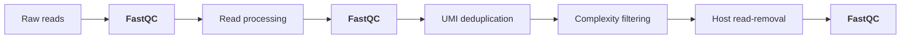
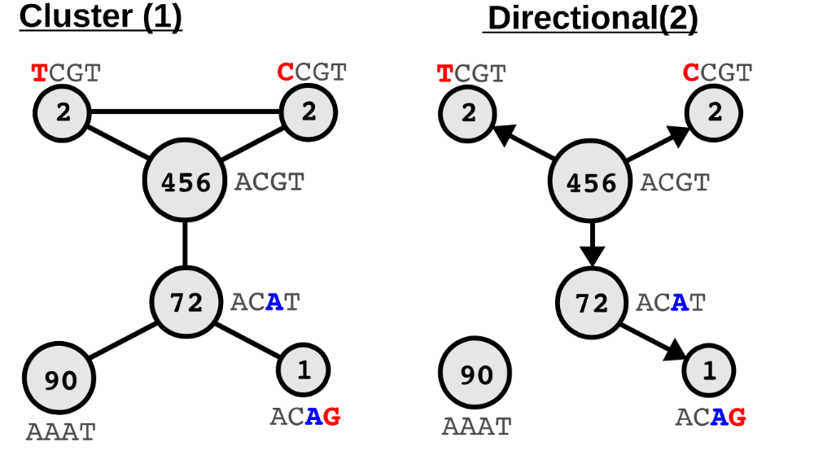

# Preprocessing

nf-core/viralmetagenome offers three main preprocessing steps for the preprocessing of raw sequencing reads:

1. [Adapter trimming](#1-adapter-trimming): adapter clipping and pair-merging.
1. [UMI deduplication](#2-umi-deduplication): removal of PCR duplicates based on Unique Molecular Identifiers (UMIs) on a read level.
1. [Read merging](#3-read-merging): merging of reads from the same sample.
1. [Complexity filtering](#4-complexity-filtering): removal of low-sequence complexity reads.
1. [Host read-removal](#5-host-read-removal): removal of reads aligning to reference genome(s) of a host.

> [!NOTE]
> Preprocessing can be entirely skipped with the option `--skip_preprocessing`.
> See the [parameters preprocessing section](../parameters.md#preprocessing-options) for all relevant arguments to control the preprocessing steps.

:::tip
Samples with fewer than `--min_trimmed_reads [default: 1]` reads will be removed from any further downstream analysis. These samples will be highlighted in the MultiQC report.
:::

## Read Quality control

[`FastQC`](https://www.bioinformatics.babraham.ac.uk/projects/fastqc/) gives general quality metrics about your reads. It provides information about the quality score distribution across your reads, per base sequence content (%A/T/G/C), adapter contamination, and overrepresented sequences. [`FastQC`](https://www.bioinformatics.babraham.ac.uk/projects/fastqc/) is used before and after read processing and after host read-removal to assess the quality of the reads.

## 1. Adapter trimming

Raw sequencing read processing in the form of adapter clipping and paired-end read merging is performed by the tools [`fastp`](https://github.com/OpenGene/fastp) or [`Trimmomatic`](https://github.com/usadellab/Trimmomatic). The tool `fastp` is a fast all-in-one tool for preprocessing fastq files. The tool `Trimmomatic` is a flexible read trimming tool for Illumina NGS data. Both tools can be used to remove adapters and low-quality reads from the raw sequencing reads. An adapter file can be provided through the argument `--adapter_fasta`.

> [!NOTE]
> Specify the tool to use for read processing with the `--trim_tool` parameter, the default is `fastp`.

## 2. UMI deduplication

Unique Molecular Identifiers (UMIs) are short sequences that are added during library preparation. They are used to identify and remove PCR duplicates. The tool [`HUMID`](https://humid.readthedocs.io/en/latest/usage.html) is used to remove PCR duplicates based on the UMI sequences. HUMID supports two ways to group reads using their UMI. By default, HUMID uses the directional method, which takes into account the expected errors based on the PCR process. Specify the allowed amount of errors to see reads coming from the same original fragment with `--arguments_humid '-m 5'`, for a distance of 5 [default : 1]. Alternatively, HUMID supports the maximum clustering method, where all reads that are within the specified distance are grouped together.

:::tip{title="Directional vs maximum clustering"}

Taken from <a href=https://umi-tools.readthedocs.io/en/latest/the_methods.html>UMI-tools: 'The network based deduplication methods'</a>

- **cluster**: Form networks of connected UMIs with a mismatch distance of 1. Each connected component is a read group. In the above example, all the UMIs are contained in a single connected component and thus there is one read group containing all reads, with ACGT as the ‘selected’ UMI.
- **directional** (default for both HUMID and UMI-tools): Form networks with edges defined based on distance threshold and $$ \text{ node A counts} \geq (2 \cdot \text{node B counts}) - 1$$
  Each connected component is a read group, with the node with the highest counts selected as the top node for the component. In the example above, the directional edges yield two connected components. One with AAAT by itself and the other with the remaining UMIs with ACGT as the selected node.

:::
nf-core/viralmetagenome supports both deduplication on a read level as well as on a mapping level. Specify the `--umi_deduplication` with `read` or `mapping` to choose between the two or specify `both` to both deduplicate on a read level as well as on a mapping level (after read mapping with reference).

> [!NOTE]
> By default,nf-core/viralmetagenome doesn't assume UMIs are present in the reads. If UMIs are present, specify the `--with_umi` parameter and `--deduplicate`.

## 3. Read merging

Certain patients or original samples can be sequenced in multiple times. This step involves merging reads from these different sequencing methods to create a comprehensive dataset for analysis.

> [!NOTE]
> only R1 will be merged with R1 and R2 with R2. Single end and paired end reads will not be merged.

This is done with `CAT`.

## 4. Complexity filtering

Complexity filtering is primarily a run-time optimization step. Low-complexity sequences are defined as having commonly found stretches of nucleotides with limited information content (e.g., the dinucleotide repeat CACACACACA). Such sequences can produce a large number of high-scoring but biologically insignificant results in database searches. Removing these reads therefore saves computational time and resources.

Complexity filtering is done with [`BBDuk`](https://jgi.doe.gov/data-and-tools/software-tools/bbtools/bb-tools-user-guide/bbduk-guide/) which is part of [`BBtools`](https://jgi.doe.gov/data-and-tools/software-tools/bbtools/) where the "duk" stands for Decontamination Using Kmers. Alternatively, complexity filtering can be done with [`prinseq++`](https://github.com/Adrian-Cantu/PRINSEQ-plus-plus).

> [!NOTE]
> By default, this step is skipped. If this step shouldn't be skipped, specify `--skip_complexity_filtering false`. Specify the tool to use for complexity filtering with the `--decomplexifier` parameter, `bbduk` or `prinseq` [default].

## 5. Host read-removal

Contamination, whether derived from experiments or computational processes, looms large in next-generation sequencing data. Such contamination can compromise results from WGS as well as metagenomics studies, and can even lead to the inadvertent disclosure of personal information. To avoid this, host read-removal is performed. Host read-removal is performed by the tool `Kraken2`.

:::info{title="Interesting reads"}
The reason why we use Kraken2 for host removal over regular read mappers is nicely explained in the following papers:

- [Benchmarking of Human Read Removal Strategies for Viral and Microbial Metagenomics](https://www.biorxiv.org/content/10.1101/2025.03.21.644587v1)
- [The human “contaminome”: bacterial, viral, and computational contamination in whole genome sequences from 1000 families](https://www.nature.com/articles/s41598-022-13269-z)
- [Reconstruction of the personal information from human genome reads in gut metagenome sequencing data](https://www.nature.com/articles/s41564-023-01381-3)

:::

> [!NOTE]
> Specify the host database with the `--host_k2_db` parameter. The default is a small subset of the human genome and **we highly suggest that you make this database more elaborate** (for example, complete human genome, common sequencer contaminants, bacterial genomes, ...). For this, read the section on [creating custom kraken2 host databases](../customisation/databases.md#kraken2-databases).

By default, the [de novo assembly](4_assembly_polishing.md) step uses host-filtered reads whenever host removal has run successfully. The [mapping steps used for iterative consensus refinement and final variant calling](5_variant_and_refinement.md#2-mapping-of-reads), however, use the pre-host-removal, decomplexified reads by default.

:::tip{title="Use host-filtered reads for mapping & polishing too"}
Set `--use_host_filtered_reads true` to also route the host-filtered reads into these downstream mapping and polishing steps.
:::
