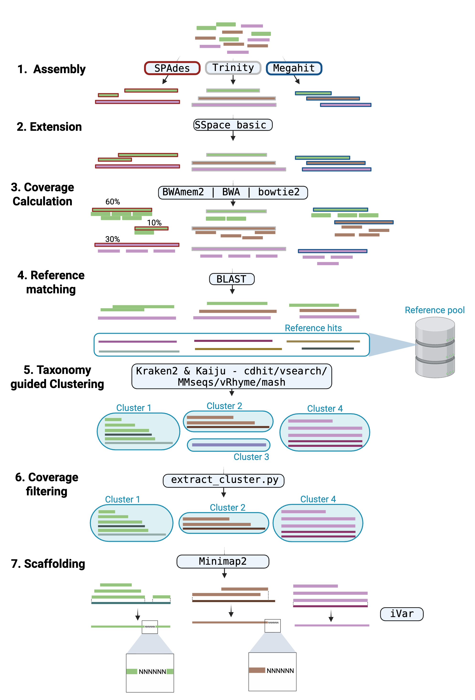
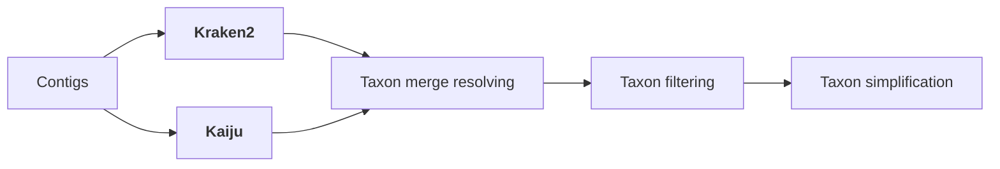
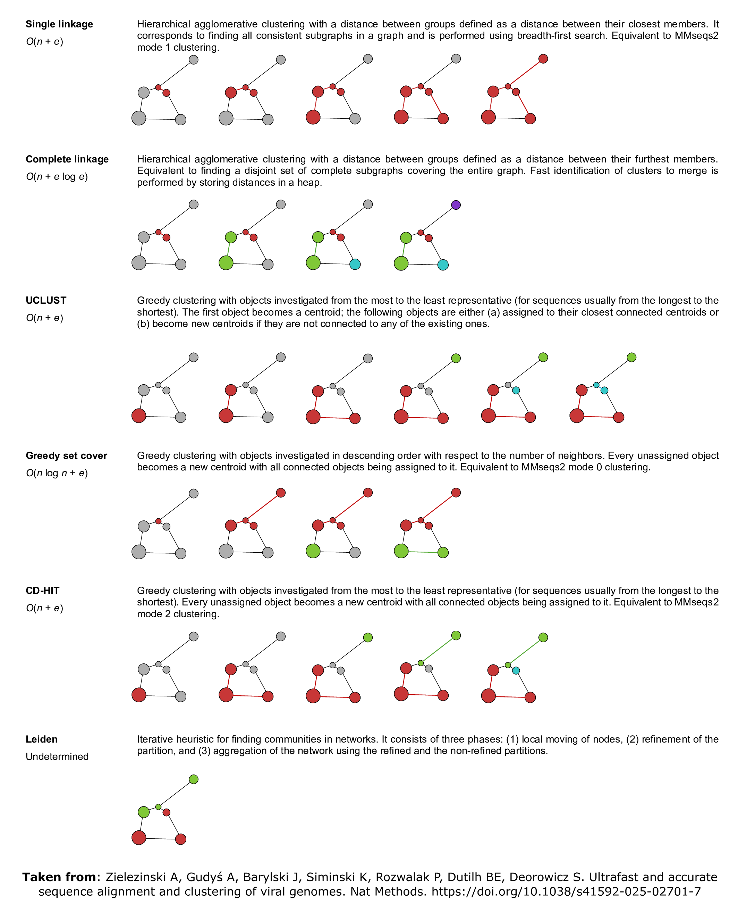

# Assembly & polishing

nf-core/viralmetagenome offers an elaborate workflow for the assembly and polishing of viral genomes:

1. [Assembly](#1-de-novo-assembly): combining the results of multiple assemblers.
1. [Extension](#2-extension): extending contigs using paired-end reads.
1. [Coverage calculation](#3-coverage-calculation): mapping reads back to the contigs to determine coverage.
1. [Reference Matching](#4-reference-matching): comparing contigs to a reference sequence pool.
1. [Taxonomy guided Clustering](#5-taxonomy-guided-clustering): clustering contigs based on taxonomy and nucleotide similarity.
   - [Pre-clustering](#51-pre-clustering-using-taxonomy): separating contigs based on identified taxonomy-id.
   - [Actual clustering](#52-actual-clustering-on-nucleotide-similarity): clustering contigs based on nucleotide similarity.
1. [Scaffolding](#7-scaffolding): scaffolding the contigs to the centroid of each bin.



> [!NOTE]
> The overall workflow of creating reference assisted assemblies can be skipped with the argument `--skip_assembly`. See the [parameters assembly section](../parameters.md#assembly) for all relevant arguments to control the assembly steps.

> [!NOTE]
> The overall refinement of contigs can be skipped with the argument `--skip_polishing`. See the [parameters polishing section](../parameters.md#polishing) for all relevant arguments to control the polishing steps.

The consensus genome of all clusters are then sent to the [variant analysis & iterative refinement](variant_and_refinement.md) step.

## 1. De-novo Assembly

Three assemblers are used, [SPAdes](http://cab.spbu.ru/software/spades/), [Megahit](https://github.com/voutcn/megahit), and [Trinity](https://github.com/trinityrnaseq/trinityrnaseq). The resulting contigs of all specified assemblers, are combined and processed further together.

> [!NOTE]
> Modify the spades mode with `--spades_mode [default: rnaviral]` and supply specific params with `--spades_yml` or a hmm model with `--spades_hmm`.

> [!NOTE]
> Specify the assemblers to use with the `--assemblers` parameter where the assemblers are separated with a ','. The default is `spades,megahit,trinity`.

Low complexity contigs can be filtered out using prinseq++ with the `--skip_contig_prinseq false` parameter. Complexity filtering is primarily a run-time optimisation step. Low-complexity sequences are defined as having commonly found stretches of nucleotides with limited information content (e.g. the dinucleotide repeat CACACACACA). Such sequences can produce a large number of high-scoring but biologically insignificant results in database searches. Removing these reads therefore saves computational time and resources.

## 2. Extension

Contigs can be extended using [SSPACE Basic](https://github.com/nsoranzo/sspace_basic) with the `--skip_sspace_basic false` parameter. SSPACE is a tool for scaffolding contigs using paired-end reads. It is modified from SSAKE assembler and has the feature of extending contigs using reads that are unmappable in the contig assembly step. To maximize its efficiency, consider specifying the arguments `--read_distance`, `--read_distance_sd`, and `--read_orientation`. For more information on these arguments, see the [parameters assembly section](../parameters.md#assembly).

> [!NOTE]
> The extension of contigs is run by default, to skip this step, use `--skip_sspace_basic`.

## 3. Coverage calculation

Processed reads are mapped back against the contigs to determine the number of reads mapping towards each contig. This is done with [`Bowtie2`](http://bowtie-bio.sourceforge.net/bowtie2/), [`BWA-MEM2`](https://github.com/bwa-mem2/bwa-mem2). This step is used to remove contig clusters that have little to no coverage downstream.

> [!NOTE]
> Specify the mapper to use with the `--mapper` parameter. The default is [`BWA-MEM2`](https://github.com/bwa-mem2/bwa-mem2). To skip contig filtering specify `--perc_reads_contig 0`.

## 4. Reference Matching

The newly assembled contigs are compared to a reference sequence pool (`--reference_pool`) using a [BLASTn search](https://www.ncbi.nlm.nih.gov/books/NBK153387/). This process not only helps annotate the contigs but also assists in linking together sets of contigs that are distant within a single genome. Essentially, it aids in identifying contigs belonging to the same genomic segment and choosing the right reference for scaffolding purposes.

The top 5 hits for each contig can be combined with the de novo contigs and sent to the clustering step when `--cluster_with_reference_pool` is enabled.

:::note

- The reference pool can be specified with the `--reference_pool` parameter.
- The default is [v31.0 of the Reference Viral DataBase (C-RVDB; Jan 9, 2026)](https://rvdb.dbi.udel.edu/).
- The input to `--reference_pool` must be a multifasta file (can be compressed `.gz`), directories or `tar.gz` will fail.
- To exclude external database sequences from clustering along with the contigs set `--cluster_with_reference_pool false`, allowing only denovo contigs to be clustered.

:::

> [!NOTE]
> Reference collections may contain truncated or defective sequences (for example some RVDB entries). Supply the `--blacklist` parameter with a newline-delimited list of identifiers (or identifier fragments) to exclude those hits during BLAST filtering and prevent them from being used as a reference during scaffolding.

## 5. Taxonomy guided Clustering

The clustering workflow of contigs consists of 2 steps, the [pre-clustering using taxonomy](#51-pre-clustering-using-taxonomy) and
[actual clustering on nucleotide similarity](#52-actual-clustering-on-nucleotide-similarity). The taxonomy guided clustering is used to separate contigs based on taxonomy and nucleotide similarity.


### 5.1 Pre-clustering using taxonomy

The contigs, and optionally their selected BLAST-hit references, have their taxonomy assigned using [Kraken2](https://ccb.jhu.edu/software/kraken2/) and [Kaiju](https://kaiju.binf.ku.dk/).

> [!NOTE]
> The default databases are the same ones used for read classification:
>
> - Kraken2: viral refseq database, `--kraken2_db`
> - Kaiju: clustered [RVDB](https://rvdb.dbi.udel.edu/), `--kaiju_db`

As Kaiju and Kraken2 can have different taxonomic assignments, an additional step is performed to resolve potential inconsistencies in taxonomy and to identify the taxonomy of the contigs. This is done with a custom script that is based on `KrakenTools extract_kraken_reads.py` and `kaiju-Merge-Outputs`.



:::tip{title="Having complex metagenomic samples?"}
The pre-clustering step can be used to simplify the taxonomy of the contigs, let [NCBI's taxonomy browser](https://www.ncbi.nlm.nih.gov/Taxonomy/Browser/wwwtax.cgi) help you identify taxon-id's for simplification. The simplification can be done in several ways:

- Make sure your contamination database is up to date and removes the relevant taxa.
- Exclude unclassified contigs with `--arguments_extract_precluster "--keep-unclassified false"` parameter.
- Simplify the taxonomy of the contigs to a higher rank using `--arguments_extract_precluster "--simplification-level <value>"` parameter (1).
- Specify the taxa to include or exclude with `--arguments_extract_precluster "--include-children <taxa>"`, `--arguments_extract_precluster "--include-parents <taxa>"`, `--arguments_extract_precluster "--exclude-children <taxa>"`, `--arguments_extract_precluster "--exclude-parents <taxa>"`, `--arguments_extract_precluster "--exclude-taxa <taxa>"` parameters.

:::warning
Providing lists to the extract precluster script is done by encapsulating values with `"` and separating them with a space. For example: `--arguments_extract_precluster "--exclude-taxa taxon1 taxon2 taxon3"`.
:::

1. Options here are 'species', 'genus', 'family', 'order', 'class', 'phylum', 'kingdom' or 'superkingdom'.

2. `--include-children` **"genus1"** :

   ```mermaid
   graph TD;
       A[family] -.- B["genus1 (included)"];
       A -.- C[genus2];
       B --- D[species1];
       B --- E[species2];
       C -.- F[species3];
   ```

   Dotted lines represent exclusion of taxa.

3. `--include-parents` **"species3"** :

   ```mermaid
   graph TD;
       A["family (included)"] -.- B["genus1"]
       A --- C[genus2]
       B -.- D[species1]
       B -.- E[species2]
       C --- F[species3]
   ```

   Dotted lines represent exclusion of taxa.

> [!NOTE]
> The pre-clustering step will be run by default but can be skipped with the argument `--skip_precluster`. Specify which classifier to use with `--precluster_classifiers` parameter. The default is `kaiju,kraken2`. Contig taxon filtering is still enabled despite not having to solve for inconsistencies if only Kaiju or Kraken2 is run.

### 5.2 Actual clustering on nucleotide similarity

The clustering is performed with one of the following tools:

- [`CD-HIT-EST`](https://sites.google.com/view/cd-hit)
- [`vsearch`](https://github.com/torognes/vsearch/wiki/Clustering)
- [`mmseqs-linclust`](https://github.com/soedinglab/MMseqs2/wiki#linear-time-clustering-using-mmseqs-linclust)
- [`mmseqs-cluster`](https://github.com/soedinglab/MMseqs2/wiki#cascaded-clustering)
- [`vRhyme`](https://github.com/AnantharamanLab/vRhyme)
- [`Mash`](https://github.com/marbl/Mash)

These methods all come with their own advantages and disadvantages. For example, cdhitest is very fast but cannot be used for large viruses >10Mb and similarity threshold cannot go below 80% which is not preferable for highly diverse RNA viruses. Vsearch is slower but accurate. Mmseqs-linclust is the fastest but tends to create a large amount of bins. Mmseqs-cluster is slower but can handle larger datasets and is more accurate. vRhyme is a new method that is still under development but has shown promising results but can sometimes not output any bins when segments are small. Mash is a very fast comparison method is linked with a custom script that identifies communities within a network.

:::tip
When pre-clustering is performed, it is recommended to set a lower identity_threshold (60-70% ANI) as the new goal becomes to separate genome segments within the same bin.
:::

> [!NOTE]
> The clustering method can be specified with the `--cluster_method` parameter. The default is `cdhitest`.

> [!NOTE]
> The network clustering method for `mash` can be specified with the `--network_clustering` parameter. Clustering is done with [Clusty](https://github.com/refresh-bio/clusty), supporting options are: `single (default) | complete | uclust | set-cover | cd-hit | leiden`.
> The default is `single`.
> Image taken from Clusty documentation, see [paper](https://doi.org/10.1038/s41592-025-02701-7).
> 

> [!NOTE]
> The identity threshold can be specified with the `--identity_threshold` parameter. The default is `0.85`.

## 6. Coverage filtering

The coverage of the contigs is calculated using the same method as in the [coverage calculation step](#3-coverage-calculation). A cumulative sum is taken across the contigs from every assembler. If these cumulative sums are above the specified `--perc_reads_contig` parameter, the contig is kept. If all cumulative sums are below the specified parameter, the contig is removed.

:::info{title="Show me an example how it works"}
If the `--perc_reads_contig` is set to `5`, the cumulative sum of the contigs from every assembler is calculated. For example:

- Cluster 1: the cumulative sum of the contigs from SPAdes is `6`, Megahit is `5`, the cluster is kept.
- Cluster 2: the cumulative sum of the contigs from SPAdes is `1`, Megahit is `1`, the cluster is removed.
- Cluster 3: the cumulative sum of the contigs from SPAdes is `5`, Megahit is `0`, the cluster is kept.

:::

> [!NOTE]
> The default is `5` and can be specified with the `--perc_reads_contig` parameter.

## 7. Scaffolding

After classifying the contigs, and optionally their top BLAST hits, into distinct clusters or bins, the cluster members are scaffolded to the centroid of each bin. Selected BLAST-hit references may be present as cluster members and any external references that are not chosen as centroids are removed before downstream consensus generation. When `--cluster_with_reference_pool false`, clustering and scaffolding proceed on contigs alone. All members of the cluster are consequently mapped towards their centroid with [Minimap2](https://github.com/lh3/minimap2) and consensus is called using [iVar-consensus](https://andersen-lab.github.io/ivar/html/manualpage.html).

> [!NOTE]
> Whenever, supplied references are to divergent from the contigs, scaffolding will be done using only the contigs themselves. This can be further controlled with the param `arguments_blast_filter`.
