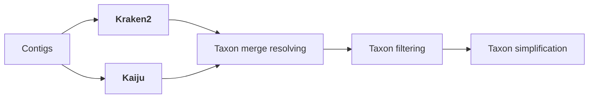

# Assembly & polishing

Viralgenie offers an elaborate workflow for the assembly and polishing of viral genomes:

- [Assembly](#assembly): combining the results of multiple assemblers.
- [Reference Matching](#reference-matching): comparing the newly assembled contigs to a reference sequence pool.
- [Clustering](#clustering): clustering the contigs based on taxonomy and similarity.
- [Scaffolding](#scaffolding): scaffolding the contigs to the centroid of each bin.
- [Annotation with Reference](#annotation-with-reference): annotating regions with 0-depth coverage with the reference sequence.

> The overal workflow of creating reference assisted assemblies can be skipped with the argument `--skip_assembly`. See the [parameters assembly section](../parameters.md#assembly) for all relevant arguments to control the assembly steps.

> The overall refinement of contigs can be skipped with the argument `--skip_polishing`. See the [parameters polishing section](../parameters.md#polishing) for all relevant arguments to control the polishing steps.

The consensus genome of all clusters are then send to the [variant analysis & iterative refinement](variant_and_refinement.md) step.

## De-novo Assembly
Three assemblers are used, [SPAdes](http://cab.spbu.ru/software/spades/), [Megahit](https://github.com/voutcn/megahit), and [Trinity](https://github.com/trinityrnaseq/trinityrnaseq). The resulting contigs of all specified assemblers, are combined and processed further together.
> Modify the spades mode with `--spades_mode [default: rnaviral]` and supply specific params with `--spades_yml` or a hmm model with `--spades_hmm`.

> Specify the assemblers to use with the `--assemblers` parameter where the assemblers are separated with a ','. The default is `spades,megahit,trinity`.

## Reference Matching
The newly assembled contigs are compared to a reference sequence pool (--reference_pool) using a [BLASTn search](https://www.ncbi.nlm.nih.gov/books/NBK153387/). This process not only helps annotate the contigs but also assists in linking together sets of contigs that are distant within a single genome. Essentially, it aids in identifying contigs belonging to the same genomic segment and choosing the right reference for scaffolding purposes.

The top 5 hits for each contig are combined with the denovo contigs and send to the clustering step.

> The reference pool can be specified with the `--reference_pool` parameter. The default is the latest clustered [Reference Viral DataBase (RVDB)](https://rvdb.dbi.udel.edu/).

## Clustering

The clustering workflow of contigs consists out of 2 steps, the [pre-clustering](#pre-clustering) and [actual clustering](#actual-clustering). Here contigs are first separated based on identified taxonomy-id ([Kraken2](https://ccb.jhu.edu/software/kraken2/), [Kaiju](https://kaiju.binf.ku.dk/)) and are subsequently clustered further to identify genome segments.

### Pre-clustering

The contigs along with their references have their taxonomy assigned using [Kraken2](https://ccb.jhu.edu/software/kraken2/) and [Kaiju](https://kaiju.binf.ku.dk/).

> The default databases are the same ones used for read classification:
> - Kraken2: viral refseq database, `--kraken2_db`
> - Kaiju: clustered [RVDB](https://rvdb.dbi.udel.edu/), `--kaiju_db`

As Kajiu and Kraken2 can have different taxonomic assignments, an additional step is performed to resolve potential inconsistencies in taxonomy and to identify the taxonomy of the contigs. The pre-clustering step is performed with [Kaiju-mergeOutputs](https://kaiju.binf.ku.dk/).

1. Specify with `--precluster_include_children`, `--precluster_include_parents`, `--precluster_exclude_children`, `--precluster_exclude_parents`, `--precluster_exclude_taxa`
2. Specify with `--precluster_simplify_taxa` to 'species', 'genus', 'family', 'order', 'class', 'phylum', 'kingdom' or 'superkingdom'.

!!! Tip
    Sometimes large metagenomic datasets, could still contain a large number of contigs that are not viral in origin and are 'unclassified' despite having accurate databases. These contigs can be removed with the `--keep_unclassified false` argument.

!!! Tip
    Specify the strategy to resolve inconsistencies with `--taxon_merge_strategy` options:
    - _'1'_ the taxon id from Kaiju is used.
    - _'2'_ the taxon id from Kraken is used.
    - _'lca'_ the least common ancestor of the two taxon ids from both input files is used.
    - _'lowest'_ the lower rank of the two taxa is used if they are within the same lineage. Otherwise the LCA is used.

> The pre-clustering step will be run by default but can be skipped with the argument `--skip_preclustering`.

### Actual clustering

The clustering is performed with one of the following tools:
    - [`cdhitest`](https://sites.google.com/view/cd-hit)
    - [`vsearch`](https://github.com/torognes/vsearch/wiki/Clustering)
    - [`mmseqs-linclust`](https://github.com/soedinglab/MMseqs2/wiki#linear-time-clustering-using-mmseqs-linclust)
    - [`mmseqs-cluster`](https://github.com/soedinglab/MMseqs2/wiki#cascaded-clustering)
    - [`vRhyme`](https://github.com/AnantharamanLab/vRhyme)
    - [`mash`](https://github.com/marbl/Mash)

These methods all come with their own advantages and disadvantages. For example, cdhitest is very fast but cannot be used for large viruses >10Mb and similarity threshold cannot go below 80% which is not preferable for highly diverse RNA viruses. Vsearch is slower but accurate. Mmseqs-linclust is the fastest but tends to create a large amount of bins. Mmseqs-cluster is slower but can handle larger datasets and is more accurate. vRhyme is a new method that is still under development but has shown promising results but can sometimes not output any bins when segments are small. Mash is a very fast comparison method is linked with a custom script that identifies communities within a network.

!!! Tip
    When pre-clustering is performed, it is recommended to set a lower identity_threshold (60-70% ANI) as the new goal becomes to separate genome segments within the same bin.

> The clustering method can be specified with the `--clustering_method` parameter. The default is `mash`.

> The network clustering method for `mash` can be specified with the `--network_clustering` parameter. The default is `connected_components`, alternative is [`leiden`](https://www.nature.com/articles/s41598-019-41695-z).

> The similarity threshold can be specified with the `--similarity_threshold` parameter. The default is `0.6`. However, for cdhit the default is `0.8` which is its minimum value.

## Scaffolding

After classifying all contigs and their top BLAST hits into distinct clusters or bins, the contigs are then scaffolded to the centroid of each bin. Any external references that are not centroids of the cluster are subsequently removed to prevent further bias. All members of the cluster are consequently mapped towards their centroid with [Minimap2](https://github.com/lh3/minimap2) and conensus is called using [iVar-consensus](https://andersen-lab.github.io/ivar/html/manualpage.html).

## Annotation with Reference

Regions with 0-depth coverage are annotated with the reference sequence. This is done with a [custom script](https://github.com/Joon-Klaps/viralgenie/blob/dev/bin/lowcov_to_reference.py) that uses the coverage of the denovo contigs towards the reference sequence to identify regions with 0-depth coverage. The reference sequence is then annotated to these regions.

> This step can be skipped using `--skip_hybrid_consensus` parameter.
