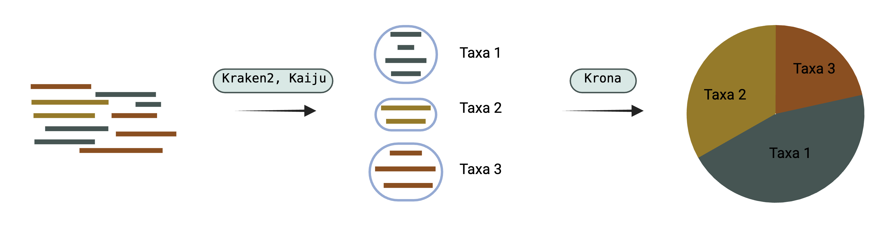

# Read classification

Viralgenie offers two main tools for the classification of reads and a summary visualisation tool:

- [Kaiju](#kaiju): Taxonomic classification based on maximum exact matches using protein alignments.
- [Kraken2](#kraken2): Assigns taxonomic labels on a DNA level using a k-mer approach. (optional Bracken)
- [Krona](#krona): Interactive multi-layered pie charts of hierarchial data.

!!! Tip "Want more classifiers?"

    Feel free to reach out and suggest more classifiers. However, if the main goal of your project is to establish the presence of a virus within a sample and are therefore only focused on metagenomic diversity, have a look at [taxprofiler](https://nf-co.re/taxprofiler/)

> The read classification can be skipped with the argument `--skip_read_classification`, classifiers should be specified with the parameter `--read_classifiers 'kaiju,kraken2'` (no spaces, no caps). See the [parameters classification section](../parameters.md#read-classification) for all relevant arguments to control the classification steps.

## Kaiju
[Kaiju](https://github.com/bioinformatics-centre/kaiju) classifies individual metagenomic reads using a reference database comprising the annotated protein-coding genes of a set of microbial genomes. It  employ a search strategy, which finds maximal exact matching substrings between query and database using a modified version of the backwards search algorithm in the Burrows-Wheeler transform is a text transformation that converts the reference sequence database into an easily searchable representation, which allows for exact string matching between a query sequence and the database in time proportional to the length of the query.

## Kraken2
[Kraken](https://ccb.jhu.edu/software/kraken2/) is a taxonomic sequence classifier that assigns taxonomic labels to DNA sequences. Kraken examines the k-mers within a query sequence and uses the information within those k-mers to query a database. That database maps -mers to the lowest common ancestor (LCA) of all genomes known to contain a given k-mer.

[Bracken](https://ccb.jhu.edu/software/bracken/) can optionally be enabled for more accurate estimation of abundancies, although these values should be interpreted with caution as viruses don't have a marker genes making it difficult to compare abundances across samples & taxa. `--read_classifiers 'kraken2,bracken'` (no spaces, no caps)

## Krona
[Krona](https://github.com/marbl/Krona/wiki) allows hierarchical data to be explored with zooming, multi-layered pie charts. The interactive charts are self-contained and can be viewed with any modern web browser.

