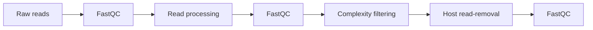

<!-- TODO: give a walktrough on how the preprocessing is done.  -->
!!! Warning "INCOMPLETE, YET TO BE WRITTEN"

# Preprocessing

Viralgenie offers three main preprocessing steps for the preprocessing of raw sequencing reads:

- [Read quality control](#read-quality-control): read quality assessment and filtering.
- [Read processing](#read-processing): adapter clipping and pair-merging.
- [Complexity filtering](#complexity-filtering): removal of low-sequence complexity reads.
- [Host read-removal](#host-read-removal): removal of reads aligning to reference genome(s) of a host.

> See the [parameters preprocessing section](../parameters.md#preprocessing-options) for all relevant arguments to control the preprocessing steps.

## Read Quality control
[`FastQC`](https://www.bioinformatics.babraham.ac.uk/projects/fastqc/) gives general quality metrics about your reads. It provides information about the quality score distribution across your reads, per base sequence content (%A/T/G/C), adapter contamination and overrepresented sequences. [`FastQC`](https://www.bioinformatics.babraham.ac.uk/projects/fastqc/) is used before and after read processing and after host read-removal to assess the quality of the reads.

## Read processing

The read processing step is performed by the tool `fastp` and `Trimmomatic`. The tool `fastp` is a fast all-in-one tool for preprocessing FastQ files. The tool `Trimmomatic` is a flexible read trimming tool for Illumina NGS data. Both tools can be used to remove adapters and low-quality reads from the raw sequencing reads.

### fastp [default]

### Trimmomatic

## Complexity filtering

[`Bbduk`](https://jgi.doe.gov/data-and-tools/software-tools/bbtools/bb-tools-user-guide/bbduk-guide/) is part of the [`BBtools`](https://jgi.doe.gov/data-and-tools/software-tools/bbtools/) where the "duk" stands for Decontamination Using Kmers. BBDuk was developed to combine most common data-quality-related trimming, filtering, and masking operations into a single high-performance tool. It is capable of quality-trimming and filtering, adapter-trimming, contaminant-filtering via kmer matching, sequence masking, GC-filtering, length filtering, entropy-filtering, format conversion, histogram generation, subsampling, quality-score recalibration, kmer cardinality estimation, and various other operations in a single pass. Specifically, any combination of operations is possible in a single pass, with the exception of kmer-based operations (kmer trimming, kmer masking, or kmer filtering); at most 1 kmer-based operation can be done in a single pass. BBDuk2 allows multiple kmer-based operations in a single pass, and is otherwise equivalent to BBDuk.

## Host read-removal

The host read-removal step is performed by the tool `Kraken2`.
