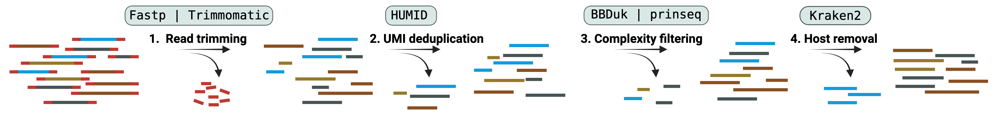
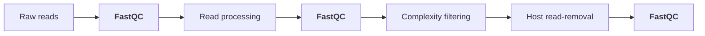

# Preprocessing

Viralgenie offers three main preprocessing steps for the preprocessing of raw sequencing reads:

- [Read quality control](#read-quality-control): read quality assessment and filtering.
- [Read processing](#read-processing): adapter clipping and pair-merging.
- [Complexity filtering](#complexity-filtering): removal of low-sequence complexity reads.
- [Host read-removal](#host-read-removal): removal of reads aligning to reference genome(s) of a host.

> Preprocessing can be entirely skipped with the option `--skip_preprocessing`.
> See the [parameters preprocessing section](../parameters.md#preprocessing-options) for all relevant arguments to control the preprocessing steps.

!!! Tip
    Samples with fewer then `--min_trimmed_reads [default: 1]` reads, will be removed from any further downstream analysis. These samples will be highlighted in the MultiQC report.

## Read Quality control
[`FastQC`](https://www.bioinformatics.babraham.ac.uk/projects/fastqc/) gives general quality metrics about your reads. It provides information about the quality score distribution across your reads, per base sequence content (%A/T/G/C), adapter contamination and overrepresented sequences. [`FastQC`](https://www.bioinformatics.babraham.ac.uk/projects/fastqc/) is used before and after read processing and after host read-removal to assess the quality of the reads.

## Adapter trimming

Raw sequencing read processing in the form of adapter clipping and paired-end read merging is performed by the tools [`fastp`](https://github.com/OpenGene/fastp) or [`Trimmomatic`](https://github.com/usadellab/Trimmomatic). The tool `fastp` is a fast all-in-one tool for preprocessing fastq files. The tool `Trimmomatic` is a flexible read trimming tool for Illumina NGS data. Both tools can be used to remove adapters and low-quality reads from the raw sequencing reads. An adapter file can be provided through the argument `--adapter_fasta`.

> Specify the tool to use for read processing with the `--trim_tool` parameter, the default is `fastp`.

## UMI deduplication

Unique Molecular Identifiers (UMIs) are short sequences that are added during library preparation. They are used to identify and remove PCR duplicates. The tool [`HUMID`](https://humid.readthedocs.io/en/latest/usage.html) is used to remove PCR duplicates based on the UMI sequences. By default, HUMID uses the directional method, which takes into account the expected errors based on the PCR process, specify the allowed amount of errors to see reads coming from the same original fragment with `--humid_mismatches`.

Viralgenie supports both deduplication on a read level as well as a mapping level, specify the `--umi_deduplication` with `read` or `mapping` to choose between the two or specify `both` to both deduplicate on a read level as well as on a mapping level (after read mapping with reference).

> By default viralgenie doesn't assume UMIs are present in the reads. If UMIs are present, specify the `--with_umi` parameter and `--deduplicate`.

## Complexity filtering

Complexity filtering is primarily a run-time optimisation step. Low-complexity sequences are defined as having commonly found stretches of nucleotides with limited information content (e.g. the dinucleotide repeat CACACACACA). Such sequences can produce a large number of high-scoring but biologically insignificant results in database searches. Removing these reads therefore saves computational time and resources.

Complexity filtering is done with [`Bbduk`](https://jgi.doe.gov/data-and-tools/software-tools/bbtools/bb-tools-user-guide/bbduk-guide/) which is part of [`BBtools`](https://jgi.doe.gov/data-and-tools/software-tools/bbtools/) where the "duk" stands for Decontamination Using Kmers.

> By default this step is skipped, if this step shouldn't be skipped specify `--skip_complexity_filtering false`.

## Host read-removal

Contamination, whether derived from experiments or computational processes, looms large in next-generation sequencing data. Such contamination can compromise results from WGS as well as metagenomics studies, and can even lead to the inadvertent disclosure of personal information. To avoid this, host read-removal is performed. Host read-removal is performed by the tool `Kraken2`.

!!! Tip "Want to know more?"
    * [The human “contaminome”: bacterial, viral, and computational contamination in whole genome sequences from 1000 families](https://www.nature.com/articles/s41598-022-13269-z)
    * [Reconstruction of the personal information from human genome reads in gut metagenome sequencing data](https://www.nature.com/articles/s41564-023-01381-3)

> Specify the host database with the `--host_k2_db` parameter. The default is small subset of the human genome and **we highly suggest that you make this database more elaborate** (for example, complete human genome, common sequencer contaminants, bacterial genomes, ...). For this, read the section on [creating custom kraken2 host databases](../customisation/databases.md#kraken2-databases).
