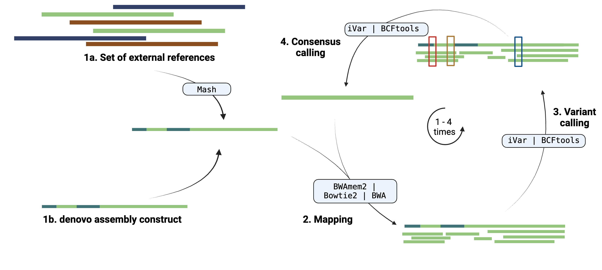

# Variant calling and consensus refinement

Viralgenie offers the opportunity to call variants and call consensus given a reference. References are supplied with the [samplesheet `--mapping_constrains`](../usage.md#mapping-constrains), here reads will be mapped to the reference genome(s) and a consensus genome will be called. The same strategy is used for the iterative refinement of the generated [(reference-assisted) de novo consensus genomes](assembly_polishing.md). During iterative refinement, the consensus genome is used as a reference for the variant calling and the variant calls are used to refine the consensus genome, this step is can then be repeated multiple times (1-4).



!!! Tip "Mapping constrains"
    A set of given references can be given to the pipeline for variant & consensus calling through the [samplesheet `--mapping_constrains`](../usage.md#mapping-constrains). They will have exactly the same workflow but will only use it once.
    ```mermaid
    graph LR
        A[Reads] --> B[Mapping constrains]
        B --> C[Variant calling]
        C --> D[Consensus calling]
        D --> E[Report]
    ```

The variant calling and consensus refinement step consists of the following steps:

- [Mapping of reads](#mapping-of-reads): (un)filtered but trimmed reads are mapped to the reference.
- [Deduplication](#deduplication): (optional) deduplication of reads can be performed with
- [Variant calling](#variant-calling): identify differences (variants) between the mapped reads and the supplied reference.
- [Variant filtering](#variant-filtering): variant filtering, only variants with sufficient depth and quality are retained for consensus calling ( only for BCFtools).
- [Mapping statistics](#mapping-statistics): (optional) generate multiple summary statistics of the BAM files.
- [Consensus calling](#consensus-calling): reference sequence is updated with the variants of sufficient quality.

!!! info
    The variant calling and consensus refinement step can be skipped with the argument `--skip_iterative_refinement` and `--skip_variant_calling`, see the [parameters iterative refinement section](../parameters.md#iterative-consensus-refinement) and [parameters variant analysis section](../parameters.md#variant-analysis), respectively, for all relevant arguments to control the variant analysis steps.

## Selection of reference

The reference genome(s) can be supplied with the [samplesheet `--mapping_constrains`](../usage.md#mapping-constrains), here the reference can be a multiFasta file representing a range of genomes that could be valid reference genomes. Here, viralgenie supports a selection procedure where the reference genomes that shares the highest number of [k-mer's](https://ucdavis-bioinformatics-training.github.io/2020-Genome_Assembly_Workshop/kmers/kmers#:~:text=A%20K%2Dmer%20is%20a,%2C%20GGC%2C%20GCC%2C%20CCG.) with the read files will be selected and kept for read mapping, variant calling and consensus genome reconstruction.


This procedure is done with [`Mash`](https://mash.readthedocs.io/en/latest/) where the reads are compared to the reference genomes and the reference genome with the highest number of shared k-mers is selected. The number of shared k-mers can be specified with the `--mash_sketch_kmer_size` (default: `15`), and the number of sketches to create with `--mash_sketch_kmer_size`, the default is `4000`.

!!! Tip

    - As in any k-mer based method, larger k-mers will provide more specificity, while smaller k-mers will provide more sensitivity. Larger genomes will also require larger k-mers to avoid k-mers that are shared by chance
    - Sketch size corresponds to the number of (non-redundant) min-hashes that are kept. Larger sketches will better represent the sequence, but at the cost of larger sketch files and longer comparison times.


## Mapping of reads

Mapping filtered reads to supercontig or mapping constrains is done with [`BowTie2`](http://bowtie-bio.sourceforge.net/bowtie2/),[`BWAmem2`](https://github.com/bwa-mem2/bwa-mem2) and [`BWA`](https://github.com/lh3/bwa).

The comparison of Bowtie2 and BWA-mem was done for [Yao et al. (2020)](https://doi.org/10.1186/s12859-020-03704-1) where they found that BWA-MEM2 had a higher mapping rate (faster) and better accuracy. BWA-mem detected more variant bases in mapping reads than Bowtie2. The tool bwa-mem2 is the next version of the bwa-mem algorithm in [bwa](https://github.com/lh3/bwa). It produces alignment identical to bwa and is ~1.3-3.1x faster depending on the use-case, dataset and the running machine.

All three methods are supported to keep protocol compatibility with other pipelines and to allow the user to choose the best method for their data.

> The mapping tool can be specified with the `--mapper` parameter, the default is `bwamem2`, in case the intermediate mapper (for intermediate refinement cycles) needs to be different, this can be specified with `--intermediate_mapper` otherwise it uses the supplied `--mapper` tool.

## Deduplication
Read deduplication is an optional step that can be performed with [`Picard`](https://broadinstitute.github.io/picard/) or if UMI's are used [`UMI-tools`](https://umi-tools.readthedocs.io/en/latest/QUICK_START.html). Unless you are using [UMIs](https://dnatech.genomecenter.ucdavis.edu/faqs/what-are-umis-and-why-are-they-used-in-high-throughput-sequencing/) it is not possible to establish whether the fragments you have sequenced from your sample were derived via true biological duplication (i.e. sequencing independent template fragments) or as a result of PCR biases introduced during the library preparation. To correct your reads, use picard MarkDuplicates to mark the duplicate reads identified amongst the alignments to allow you to gauge the overall level of duplication in your samples.
So if you have UMI’s, no need to use Picard, instead use UMI-tools to deduplicate your reads. Where instead of mapping location and read similarity, UMI-tools uses the UMI to identify PCR duplicates.

> Specify `--deduplicate` to enable deduplication, the default is `true`. If UMI's are used, specify `--with_umi` to enable UMI-tools deduplication. UMI's can be in the read header, if it is not in the header specify `--skip_umi_extract false`, the default is `true`.

> By default the UMI's are seperated in the header by ':' if this is different, specify with "--umi_separator 'YOUR_SEPARATOR'".


## Variant calling

Variant calling is done with [`BCFTools`](http://samtools.github.io/bcftools/bcftools.html) and [`iVar`](https://andersen-lab.github.io/ivar/html/manualpage.html), here a SNP will need to have at least a depth of 10 and a base quality of 20.

BCFtools is a set of utilities that manipulate variant calls in the Variant Call Format (VCF) and its binary counterpart BCF. iVar is a computational package that contains functions broadly useful for viral amplicon-based sequencing while each of iVar functions can be accomplished using existing tools, iVar contains an intersection of functionality from multiple tools that are required to call iSNVs and consensus sequences from viral sequencing data across multiple replicates.

There are multiple studies on the benchmarking of variant callers as this is a area with active development. For instance [Bassano _et al._ (2023)](https://doi.org/10.1099/mgen.0.000933) noticed that BCFtools called mutations with higher precision and recall than iVar. However, the reason behind this is that iVar has a lower precision then the others within their setup as it detects a lot of ‘additional’ variants within the sample, resulting in a higher amount of false positives but also true positives.

!!! Tip
    Bcftools doesn't handle well multiallelic sites, so if you have a lot of multiallelic sites, iVar is the better choice. iVar is also the better choice if you have a lot of low-frequency variants.

> The variant caller can be specified with the `--variant_caller` parameter, the default is `ivar`. In case the intermediate variant caller (for intermediate refinement cycles) needs to be different, this can be specified with `--intermediate_variant_caller` otherwise it uses the supplied `--variant_caller` tool.

## Variant filtering

The following steps are implemented for variant filtering.

- [only for `BCFtools`]: split up multiallelic sites into biallelic records and SNPs and indels should be merged into a single record.
- Variant filtering: filter out variants with an allelic depth of less than 75% of the average depth of the sample.
- [only for `iVar`]: strand bias correction & collapsing variants belonging to the same codon.

!!! Info
    If these filtering options are not to your liking, you can modify all of them. See the section on [configuration](../customisation/configuration.md) for more information on how to do so.

## Mapping statistics

Viralgenie uses multiple tools to get statitics on the variants and on the read mapping. These tools are:

- [`samtools flagstat`](https://www.htslib.org/doc/samtools-flagstat.html) to get the number of reads that are mapped, unmapped, paired, etc.
- [`samtools idxstats`](https://www.htslib.org/doc/samtools-idxstats.html) to get the number of reads that are mapped to each reference sequence.
- [`samtools stats`](https://www.htslib.org/doc/samtools-stats.html) to collects statistics from BAM files and outputs in a text format.
- [`picard CollectMultipleMetrics`](https://broadinstitute.github.io/picard/command-line-overview.html#CollectMultipleMetrics) to collect multiple metrics from a BAM file.
- [`mosdepth`](https://github.com/brentp/mosdepth) to calculate genome-wide sequencing coverage.

There is a little overlap between the tools, but they all provide a different perspective on the mapping statistics.

> By default, all these tools are run, but they can be skipped with the argument `--mapping_stats false`. In case the intermediate mapping statistics (for intermediate refinement cycles) don't need to be determined set `--intermediate_mapping_stats false`.

## Consensus calling

The consensus genome is updated with the variants of sufficient quality, either the ones determined previously in variant [calling](#variant-calling) and [filtering](#variant-filtering) for the `--consensus_caller` [`bcftools`](https://samtools.github.io/bcftools/bcftools.html#consensus) or they are redetermined for [`ivar`](https://andersen-lab.github.io/ivar/html/manualpage.html#autotoc_md19).

There are again a couple of differences between the iVar and BCFtools:

1.	Low frequency deletions in iVar.
> Area’s of low frequency are more easily deleted and not carried along with iVar, this can be a bad thing during the iterative improvement of the consensus but is a good thing at the final consensus step.
2. Ambiguous nucleotides for multi-allelic sites in iVar.
> iVar is capable to give lower frequency nucleotides ambiguous bases a summarising annotation instead of 'N'. For example at a certain position, the frequency of 'A' is 40% and of 'G' is 40%. Instead of reporting an 'N', iVar will report 'R'.
>
> {.center}
3. Ambiguous nucleotides for low read depth.
> In case of a low read depth at a certain position, if it doesn't get flagged by bcftools during variant calling, it will not be considered as a variant and the consensus will not be updated. iVar will update the consensus with an ambiguous base in case of low read depth.
>
> {.center}


> The consensus caller can be specified with the `--consensus_caller` parameter, the default is `ivar`. The intermediate consensus caller (for intermediate refinement cycles) can be specififed with `--intermediate_consensus_caller` and is by default `bcftools`.
